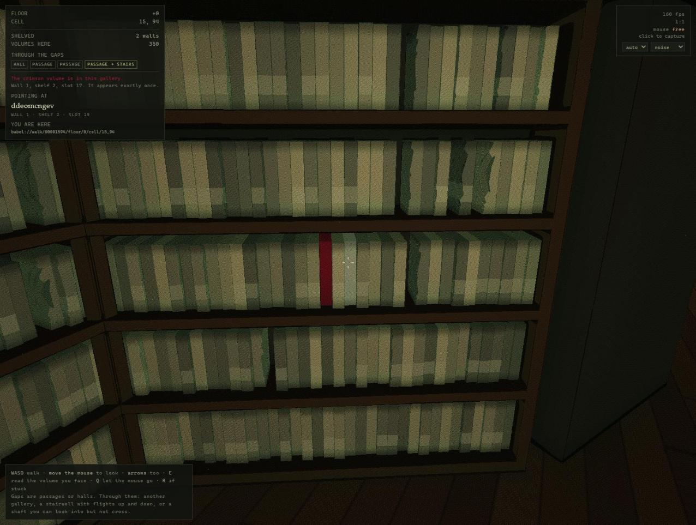

# The Library of Babel

A deterministic, walkable Library of Babel. The corpus is **29^1,312,000** volumes
and none of them is stored: every room and every symbol is a pure function of its
address, so the renderer, an agent and the tests all see the same Library — and a
coordinate in it can be cited and checked.

Walking reaches about **1.8 × 10¹⁹** distinct volumes of that corpus, on some
8 × 10²¹ shelves. Reaching an *arbitrary* one instead takes a text address, and
that is not a shortcoming but arithmetic: a coordinate able to name any book is
778 KiB long, at which size the address **is** the book. §17.12 of the
specification has the numbers, and how a 32-bit key once capped the walkable part
at 4.3 billion.

Derived from Borges's story treated as a requirements document. Where the build
departs from it, §17 of the specification says so, with the measurement that
justified the departure.



## If you were handed this link and asked to explore the Library

Three commands, no install, nothing to build:

```sh
git clone https://github.com/davidreyburn/library-of-babel
cd library-of-babel
node tools/babel.mjs here 0,0          # if this prints a room, you are ready
```

Everything works from a clean clone: Node 18 or newer and no dependencies at
all. Then read [`.claude/skills/library-of-babel/SKILL.md`](.claude/skills/library-of-babel/SKILL.md) —
it is the whole interface, and in Claude Code it loads itself once this
directory is your working directory.

The one rule the environment cares about: **verify every citation before you
report it.** `node tools/babel.mjs verify <address> <page> <line> <col> "<quote>"`
exits 0 if the symbols really are there and 2 if they are not. There is no judge
model involved — the corpus is a pure function of the address, so a fabricated
citation is not a matter of opinion.

## Run it

Node 18+. No dependencies, nothing to install.

```sh
npm start                 # serves the repo; opens at app/babel-phase1.html
```

or double-click `app/play.cmd` (Windows) / `app/play.sh` (macOS, Linux).

**WASD** to walk, mouse to look, **E** to read the volume you are facing, **Q** to
hand the mouse back, **R** if you get stuck. Served at top level like this you get
real mouse capture; the published artifact cannot have it, because artifact frames
are sandboxed without `allow-pointer-lock`.

**Z** opens a floor-and-cell box with a **Random** button — it refuses anywhere you
could not stand and says why. **X** picks a shelved gallery six to fifteen rooms
off, walks you there through the doorways and up or down the stairs, and hands you
a volume open at a page; X again stops it, and so does touching WASD. Destination,
volume and page all come from one seed, so a journey is repeatable and citable.

Two addresses open things directly:

```
app/babel-phase1.html?at=babel://walk/00001594/floor/-2/cell/-3,0
app/babel-phase1.html?read=babel://walk/00001594/floor/0/cell/15,94/wall/1/shelf/2/slot/17/page/203
```

## Use it without the renderer

```sh
node tools/babel.mjs here 15,94                     # the room, and every way out
node tools/babel.mjs read "babel://walk/00001594/floor/0/cell/15,94/wall/1/shelf/2/slot/17"
node tools/babel.mjs find "the library is unlimited and cyclical."
node tools/babel.mjs wander --route 1941 --steps 24
node tools/babel.mjs seat   --route 1941
node tools/babel.mjs verify <address> <page> <line> <col> "<quote>"
```

`--json` on any command for machine-readable output. To import the modules
instead, see [`core/README.md`](core/README.md).

An agent skill is included at `.claude/skills/library-of-babel/`, which is mostly
about the discipline the environment rewards: verify every citation before
reporting it, and say what you went looking for.

## Test it

```sh
npm test          # 138 core assertions + 41 gates
npm run check     # non-zero if app/ is stale relative to core/
npm run harness   # run policies over a corpus of episodes, print the readout
```

For the GPU half, `npm start` and open `core/conformance.html`: it runs the
shader's own copy of the lattice against the CPU's and compares 500 integers.

## Layout

```
app/          the simulator, one self-contained file, generated from core/
core/         the lattice and the corpus: one implementation, three consumers
  README.md   the module tour and the babel:// scheme
  RUN.md      what one agent excursion is, and what number says it went well
spec/         the technical and design specifications, and the headless-twin pattern
tools/        a static server and a command-line Library
docs/         the case study, the bug log, and screenshots of the build
notes/        the PDF-to-Markdown converter used on the source text
ROADMAP.md    what is open, and in what order
```

Each document has one job: the specification says what the Library **is**, the
roadmap says what is **next**, the bug log says how each defect was **found**,
and the case study says how the whole thing was **made**.

## Two things worth knowing before reading the code

**A book's address is its content.** That is the story's own constraint and it
decides everything: nothing is stored, so nothing can be catalogued, since an
address is exactly as large as the book it names.

**Every symbol is computed from its own position.** `symbolAt(address, p)` is
O(1), so a page costs its own 3,200 symbols and the last page of a book is no
dearer than the first. There is no bignum anywhere in the system.

## The source text

Borges's story is **not** in this repository — it is under copyright and not ours
to redistribute. Nothing here needs it at runtime; the build, the tests and the
simulator never read it. The specifications cite short fragments for traceability,
and [`SOURCE.md`](SOURCE.md) explains the arrangement and where to put your own
copy if you want it beside the notes.

## Licence

MIT — see [`LICENSE`](LICENSE). It covers this repository's work, not the story.

## Reading further

- [`spec/technical-specification.md`](spec/technical-specification.md) — the
  requirements, and §17 for every departure
- [`ROADMAP.md`](ROADMAP.md) — what is open, in rough order of value
- [`docs/BUG-LOG.md`](docs/BUG-LOG.md) — eleven defects, and how each was
  actually found
- [`docs/CASE-STUDY.md`](docs/CASE-STUDY.md) — how it was built, weighted toward
  what went wrong
- [`core/RUN.md`](core/RUN.md) — the agent environment and its four gates
