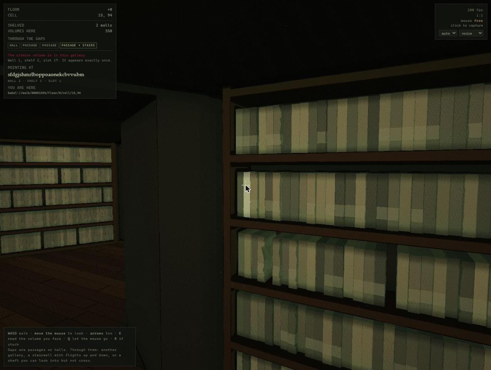

# Bug log

Sixteen defects, and how each was actually found. Written from the assistant's
side of the collaboration, in the sessions that produced them.

In every case the method that found it was the same: **measure the thing, or
probe the thing, rather than reason about it.** In seven cases the confident
reasoning was simply wrong, and the way each wrong diagnosis died is the useful
part — so the failed theories are kept here rather than tidied away.

**Twelve are closed and four are open**, and the difference is not "did anyone
write a fix." A defect is **closed** here when the mechanism was named, the fix
was made, and the fix was checked by something other than the eye that reported
it. A defect is **open** when it is reported and reproducible but the mechanism
is not yet established — or, in one case, established and deliberately not
scheduled. An open entry earns its place by saying what has been *ruled out*
and with what measurement, so the next attempt starts where the last one
stopped rather than re-running the same three theories. An open entry with no
ruled-out list is a bug report, not an investigation.

Nothing moves from open to closed on the strength of "it looks better now."
§11 is the standing reason: it was announced fixed twice and was not.

This is the detailed record. The transferable lessons drawn out of it are in
[`CASE-STUDY.md`](CASE-STUDY.md); what is scheduled is in
[`../ROADMAP.md`](../ROADMAP.md); and what the fixes did to the built Library is
in [`../spec/technical-specification.md`](../spec/technical-specification.md) §17.

| # | Defect | Found by | Status |
|---|---|---|---|
| 1 | Mouse capture silently impossible in an artifact frame | reading the iframe's `sandbox` attribute | closed |
| 2 | The reading lamp lit from the wrong wall | a GPU conformance harness, on its first run | closed · §17.10 |
| 3 | A reading room cost 2.4× a bare gallery | stubbing the suspect, after two wrong guesses | closed · §17.4 |
| 4 | An aliased import that survived a byte-identical test | evaluating the inlined copy instead of comparing it | closed · §17.10 |
| 5 | A room address that could not be parsed | only reproducible in a browser | closed · §17.8 |
| 6 | The reticule drifting off target | arithmetic, then a centre-pixel probe | closed · §17.9 |
| 7 | 32 of 40 journeys dead | driving 40 complete journeys headlessly | closed · §17.11 |
| 8 | The stairs were fine; the harness was walking on air | a value sitting at exactly 0.00 in the log | closed · §17.11 |
| 9 | The walkable Library was 32 bits wide | being asked a question from outside | closed · §17.12 |
| 10 | A shader that compiled in 17 ms and would not link in 127 s | instrumenting the link step, then removing real code | closed · §17.13 |
| 11 | Dark continents on the shelves — and then on the stone | ablation, four times, three of them wrong | **partly closed** · §17.14 |
| 12 | Two counting conventions, and a verifier that called true citations false | cross-checking a score against a second code path | closed |
| 13 | Wall mottling: a march tolerance and a normal probe that disagreed | a validated normal-error metric off the whatis render | **OPEN** · 71% removed at step 0.60 |
| 14 | A doorway into a stairwell that arrives nowhere | reading `gapAt` after the seam called it a dead end | **OPEN** |
| 15 | The shader is one small edit away from an 81-second link | the link timer §17.13 left behind | **OPEN** |
| 16 | The floorboards give out 12,604 storeys up | float32 arithmetic against the reported floor number | **open, unscheduled** |

---

## Closed

---

### 1. Mouse capture — a guess stated as fact, then the real answer

Mouse look stopped working. I offered an explanation — artifacts render in a
cross-origin iframe, and Chrome refuses pointer lock there — and shipped a
workaround. The user pushed back: *"well pointer lock had worked previously so
something must have happened."*

He was right to. My verification had been invalid: `entered` was still `false`,
meaning my synthetic click never reached the page, and `visibilityState` was
`"hidden"`, which alone makes pointer lock impossible by specification. I had
measured my own test harness.

The actual answer took one call once I looked in the right place. Reading the
artifact's iframe attributes from the parent page:

```
sandbox="allow-scripts allow-same-origin allow-forms"
```

No `allow-pointer-lock`. By the HTML sandbox specification that sets the
sandboxed-pointer-lock flag, so `requestPointerLock()` in that frame can never
succeed — Chrome's own error says so. My original guess was right in substance
and wrong in mechanism, which is worth distinguishing: it isn't the
cross-origin-ness, it's a missing token.

I also checked and discarded a second line of evidence that looked convincing:
`featurePolicy.allowsFeature("pointer-lock")` returned `false`, but
`features()` shows Chrome does not recognise `pointer-lock` as a policy feature
at all, so that `false` meant nothing.

**Outcome:** the failure is now *visible* — a `mouse: captured / free` row with
the reason — because the thing that cost a session was a silent failure, not a
hard one. Real capture needs a top-level tab, which `app/play.cmd` provides.

### 2. The reading lamp lit from the wrong wall — found by a GPU harness on its first run

The lattice was written twice, in GLSL for the renderer and in JavaScript for
collision and the HUD, kept in step by hand. It had drifted before. Extracting it
into `core/` and inlining it at build time fixed the *structural* problem; the
GLSL, though, is a port and not a copy — no `Math.imul`, no 53-bit doubles — so
it can only be trusted by being run.

`core/conformance.html` runs the shader's own copy over shared vectors on the
GPU, reads the results back through an `RGBA32UI` framebuffer so the integers
come back exact, and compares them against the CPU. First run: **483 of 484 lanes
agreed.** The one that did not was a reading room's furniture anchor.

The cause: the GLSL carried *two* anchor rules. `cellDesc` placed the furniture
by best fit, while `studyAnchor` — used by `lighting()` to position the reading
lamp's light — returned the first blank wall. In any room where those differ, the
lamp lit from a wall it was not standing against. One rule now, both callers using
it.

That bug was invisible to inspection, invisible to the renderer's own output at a
glance, and caught by 484 integer comparisons.

### 3. The reading-room performance cliff — found by stubbing, after two wrong guesses

The user reported the renderer had "taken a major hit". I benchmarked three
builds at the same three positions:

| standing in | this morning | my change | after the fix |
|---|---|---|---|
| gallery, no reading room near | 6.73 ms | 6.84 | **6.44** |
| gallery beside a reading room | 7.99 ms | 8.72 | **7.63** |
| lamp-lit reading room | 15.71 ms | 16.33 | **9.18** |

My change had cost 0.6 ms, not the cliff. But the measurement found a real one
that predated it: **a reading room cost 2.4× a bare gallery.**

I then guessed twice, wrongly. First that a duplicated anchor scan was the cost —
it was 0.6 ms of a 9 ms gap. Then that hoisting a distance check would help — it
gained **0.02 ms**. Only when I stopped reasoning and *stubbed the suspect* did it
resolve: replacing `furniture()` with a constant took the room from 15.22 to 5.98
ms, so the furniture path was 60% of the frame.

And it was not the geometry. `furniture()` re-ran the doorway culling — four
scans, each walking six walls — on every one of the ~80 `mapAt` evaluations a
pixel makes across the march, the normal and the ambient term. The result depends
on the cell and never on the sample point. It is now computed once per cell and
stashed in four bits of the packed `desc` integer.

**The lesson I wrote down:** stub the suspect before optimising it. Two plausible
mechanisms, both mine, both wrong, and the stub took two minutes.

### 4. An aliased import that survived a byte-identical comparison

The core is inlined into the single-file app at build time, and a text-identity
drift test compares the inlined copy against the module byte for byte. That test
passed while the app was broken.

`babel-text.mjs` imported with aliases — `wander as coreWander`. Stripping the
import statement for inlining leaves the alias naming nothing, so the app threw
in the browser while the bytes matched perfectly.

**Outcome:** the drift test now also *evaluates* the inlined blocks and calls into
them. Comparing text is not the same as running it.

### 5. A room address that could not be parsed — found only in a browser

`?read=<address>` silently failed to open. Two causes, stacked:

- The startup handler ran before the input section's `const` declarations were
  initialised, so `openBook` hit a temporal-dead-zone error. `?at=` worked and
  `?read=` did not, because only one of them touched a later binding. Both parse
  identically outside a browser, so nothing in 144 assertions could have caught
  it.
- Underneath that, a genuine design gap: reading rooms have no shelved wall, so
  the parser — which insisted every walk address name a volume — threw on their
  own addresses. Addresses now have two scopes, a **room** to stand in and a
  **volume** to read, and asking a room for a page is an error rather than a
  guess.

### 6. The reticule drifting off target — arithmetic, then a pixel probe

The user: *"the reticule seems off-target as i go to the far left and right of
the screen."*

The targeting ray intersected a single plane at `APO_ROOM`, the back of the
casework. The spines stand proud of it by their own depth, about 0.18 m, so the
aim was wrong by `0.18 × tan θ` along the wall:

| angle from the wall normal | error |
|---|---|
| 0° | 0 books |
| 30° | 2.0 |
| 45° | 3.5 |
| 60° | 6.0 |

Exact dead-on, which is precisely why my earlier test had passed — I had aimed
squarely at slot 17 and got slot 17.

The fix tests the actual front face of every slot on every wall it faces: 350
plane intersections, measured at 0.0035 ms, or 0.05% of a frame. Exhaustive
rather than clever, because there is no candidate window to get wrong.

Verified by probing the renderer rather than by eye: for 49 angles from −76° to
+76° across three pitches, render, read the **centre pixel**, switch the
highlight off, read it again. If the pixel changes, the highlighted spine is the
one under the crosshair. **49 / 49 on target**, and the old ray disagreed with the
new one at 24 of 44 of those angles.



### 7. A walker that could not walk — 32 of 40 journeys dead, and the reason was geometry

The user asked for an auto-walk: pick a shelved gallery some rooms off, walk
there through the doorways and up the stairs, and open a book on arrival. The
routing was straightforward and its tests passed — every route replayed legally,
move for move, against the lattice.

Then I drove 40 complete journeys headlessly and **4 arrived.** Thirty-two got
stuck, and every one of them had the same signature: standing in a gallery,
pressed against a wall with exactly `−RADIUS` of clearance, 3.26 m from its next
waypoint, and the wall between it and that waypoint had no doorway in it.

The walker was in the wrong room. The cause is a number that had been in the
constants the whole time and that I had never put together: a gallery is 3.64 m
across, but cell centres are **4.84 m** apart. **Adjacent rooms do not touch.**
They are joined by a corridor about a metre wide. Steering from wherever you
happen to be straight at the next centre therefore does not go through the
doorway — it clips the wall, or threads a *different* doorway and strands you one
wall away from a waypoint you can no longer reach.

Every opening is now a waypoint of its own, which took arrivals to 23%. The rest
came from giving up on precision entirely: steering through a one-metre gap is
approximate, so instead of tuning it, the walker notices it is in a room its
route never mentioned and asks the lattice for a new one from where it actually
is. 17 of 400 journeys re-plan once and arrive anyway.

### 8. The stairs were fine; the harness was walking on air

Between those two fixes I spent a long time on the wrong thing, and it is the
most useful bug in this document.

Journeys kept dying one room after a flight of stairs. The trace was damning:
the walker entered the stairwell, crossed it, emerged in the far gallery — and
its floor was still 0 when the route said 1. So the next room's doorways did not
exist and it pushed at a wall. I measured the flight itself: on-axis, rise +1,
the tread ramping cleanly 0 → 2.6 m along a path with clearance to spare. The
geometry was perfect and the walker still would not climb.

Then I looked at what the log said rather than what I expected it to say. `feet`
was **exactly 0.00** for the entire traversal, while `groundY` reported the
correct tread beneath them at every step. Nothing was applying it.

The line that makes the feet follow the ground lived inside the frame loop. My
harness called `autoStep()` in a loop and never called `frame()`, so the walker
slid through the world at a fixed height, its storey never changed, and every
route across a flight failed one room later. **The stairs had never been
broken.** I had built an instrument that omitted a part of the state and then
believed it about the part it omitted.

It is now `stepBody()`, a named function the frame loop and the harness both
call. One extraction, and arrivals went from 23% to **98%** — 246 of 250, then
395 of 400 on a fresh seed family, 370 of them crossing at least one flight.

The measured result, once it worked:

| | |
|---|---|
| Journeys completed | 395 of 400 (98.8%) |
| Duration | 25.6 s at p10, 40 s median, 50.3 s at p90, 87.4 s worst |
| Reticule agreed with the volume that opened | 400 of 400 |
| Failures | 2 stuck, 1 wrong storey, 2 nothing shelved in range — every one reported with its reason |
| Cost | 0.0067 ms per frame; a one-off 8 ms on the keypress |

The last row of that table cost one more fix. At 196 arrivals the reticule
disagreed with the opened book *once* — the walker was stopping up to 0.55 m off
the middle of the room, and from there the aim line could catch a neighbouring
spine. Tightening the final waypoint to 0.20 m closed it: 400 for 400. A
one-in-two-hundred defect is exactly the kind that ships.

### 9. The Library was 32 bits wide — found by being asked a question

The user asked what looked like a reading-comprehension question: why isn't the
walkable lattice the whole corpus, how much do we have, and could it all be made
traversible? The first two thirds of the answer were already written down. The
last third wasn't true.

The documented figure was ~10²² volumes, and it is correct — as a count of
*shelves*. But a shelved volume's content is `streamDigit(walkKey(a), …)`, and
`walkKey` returned **one 32-bit word**. Every symbol of every book came through
that gate. So the walkable Library held at most 2³² distinct texts — about 4.3
billion — spread over 8 × 10²¹ slots, each text repeated some 2 × 10¹² times.

That is not a rounding error in a document. It is a defect you can *see from
inside*: the expected first pair of shelves holding the identical book sits at
√(2 × 2³²), about 93,000 slots, which is **170 galleries** — a long walk, but not
an impossible one. And LIB-C-021 says "no two identical books."

I found the pair:

```
babel://walk/00001594/floor/0/cell/0,20/wall/4/shelf/3/slot/26
babel://walk/00001594/floor/0/cell/2,32/wall/0/shelf/0/slot/19
```

Same text, same spine `rcaabbbozxnfedhgxqws`. Twenty such pairs in a 500,000-slot
scan, implying a key space of 6.3 × 10⁹ — the birthday curve for 2³², to within
noise.

The fix is two independent lanes instead of one, and the interesting part is that
it was **free**. `mix(a, b, c)` has two inputs constant across a whole book and
one that varies with position, so two `mix` calls can carry four constant words —
128 bits of key — without a single extra per-symbol operation. Measured at
0.995× for 64 bits and 1.02× for 128; a third `mix` would have cost 81%. I took
64, because reaching 128 means folding lanes into the domain word and blurring
the separation between streams for no gain anyone could observe.

Two things fell out of looking properly. The old code recomputed two XOR
constants **and the entire `walkKey`** inside every symbol — 9,600 redundant
hashes per page — so hoisting made reads **33% faster** while the key got twice
as wide. And the renderer turned out to be entirely uninvolved: `streamDigit`
appears nowhere in the GLSL, so frame time could not move, which is the first
thing worth checking when someone asks whether a change will be expensive.

The proof that the second lane earns its place is the assertion I'd keep if I
could keep only one: in 500,500 addresses, twenty pairs still collide in lane 0 —
as a 32-bit lane must — and **none of them collide in lane 1**. If a future edit
ever derives the second lane from the first, that test fails immediately. Three
million slots now scan clean where one lane would have produced a thousand
duplicates.

Every walk citation in existence changed as a result, including the crimson
volume's spine (`aknvr` → `omzpawrdrcabtjknbrgligcqdak`). Text citations did not:
the second text lane is the constant the old code derived internally, so those
verify exactly as before. I checked that nothing in the repository quoted a
generated passage or spine label *before* making the change, rather than
discovering it afterwards.

**The lesson is not about hashing.** Two sessions of tests, four gates, a GPU
conformance harness and 119 assertions all passed while the Library was a
four-billionth of the size it claimed. Every one of them checked that the thing
was *self-consistent*. None asked how big it was. The question came from outside,
and the honest answer required arithmetic nobody had done.

### 10. A shader that compiled in 17 ms and would not link in 127 seconds

Session three added the corridor — Borges's hallway, the fifth cell type, with
a mirror and a latrine in alcoves off it (spec §17.13). The lattice work went in
cleanly and the tests were green. Then the page froze.

Not crashed. Froze: a blank canvas, a veil still saying *click to enter*, and a
JavaScript main thread that would not answer for 45 seconds at a time. Reloading
made it worse, and after the third attempt Chrome disabled WebGL for the whole
session, so even a fresh tab reported *WebGL2 unavailable* — which reads like a
machine problem and is not one.

Two failures were tangled together, and separating them was the whole job.

The first was mine and stupid: a comment I wrote inside the fragment shader's
template literal contained a pair of backticks, which closed the string. 153,000
characters of JavaScript stopped parsing. The symptom is indistinguishable from
the second failure — a page that loads, styles itself, and never starts — and I
spent two reloads on the wrong theory before checking. `new Function(script)`
over the file finds it in a millisecond, and there is now an assertion that does
exactly that on every test run.

The second was real. I instrumented the link step rather than guessing again:

```
compile   16.8 ms
link     127362.9 ms   ->  false, and getProgramInfoLog() returned ""
```

An empty log after two minutes is an inlining blow-up, and I had an obvious
suspect. The corridor picked its axis by preferring one with a flight of stairs
at the end *whose own axis agreed*, so `corridorAxis` called `axisOf` on a
neighbour — and `gapAt` calls `corridorAxis`, `cellDesc` calls `gapAt` six
times, and the shader calls `cellDesc` for every cell every ray enters. That is
a genuinely bad thing to put on that path, so I replaced it with a flat pass of
type comparisons that buys the same arrangement from the other side: the
corridor accepts a flight as an end, and the *stair* prefers an axis with a
corridor at one. Both versions put a flight at the end of 1 corridor in 5.

**It was still broken.** 140.9 seconds. My suspect was innocent, and so was the
second one — I stubbed `studyAnchorAt` out of `lighting()`, on the theory that
126 inlined copies of a now-larger `gapAt` was the multiplier, and that changed
nothing either.

The cause was **two call sites**. I had written the mirror the obvious way:
march, shade, and if the surface was a mirror, march and shade again. ANGLE
inlines, so `main()` held two copies of a body that already contains `mapAt`
eight times over — once for the march, four for the normal, three for the
ambient term — plus `lighting()`. Deleting the second bounce made the link
instant. The fix was not to delete it but to make it a **loop**, with the bounce
count passed as a *uniform* rather than the constant 2, because a compiler
cannot unroll a loop whose bound it does not know. One call site, same picture,
and it links.

**Four things I would keep.** My first bisection was worthless: I disabled the
reflection with a runtime `if`, which changes nothing about what the compiler
emits, and it cleared a suspect that was in fact guilty. Guarding code at
runtime does not remove it. Second, both of my confident diagnoses were wrong
and the third guess was right only because I had finally made each test remove
real code. Third, my instrument lied to me once before it helped: timing
`linkProgram` alone reported **0.0 s** for a link that had just hung the tab for
ninety seconds, because ANGLE defers the work to the `LINK_STATUS` query. An
instrument you have not checked is a confident source of wrong numbers. Fourth,
and the reason this section exists: **a link failure is allowed to be silent,
and a frozen page looks exactly like a broken machine** — after three reloads
Chrome disabled WebGL for the entire session, which sent me hunting a hardware
problem that did not exist. The link step now times the right pair of calls and
prints the elapsed time when the driver has nothing to say.

The reflection ended up costing nothing where nobody is looking at a mirror —
6.67 ms either way in a gallery — and +19% on a frame filled with one. Verified
by pixel probe rather than by eye: with the bounce off the glass is a flat dark
pane, with it on 68% of the pixels across the alcove change, and in a corridor
whose opposite alcove holds the latrine, what appears in the glass is the
latrine.

### 11. Dark continents on the shelves — the shading measuring the shader's own approximation

The user sent a screenshot of a gallery with large, smooth, dark shapes lying
across a wall like a map of a coastline, and said they also appeared on the
books. This one is worth recording because the answer was in a place I would
not have looked, and because three plausible theories died first.

**Theory one: the ray budget.** Grazing angles make a march take many small
steps, and a ray that exhausts its 72 steps renders as background — dark. I
made the shader paint step-exhausted pixels red, near-exhausted green. The
marked pixels lay in thin lines along silhouette edges and nowhere near the
blotches. Dead.

**Theory two: the tone ramp.** The renderer quantises luminance to six levels,
which can turn a tiny discontinuity into a hard visible edge. Turning the
quantiser off left the blotches in place, softer. Dead.

**Theory three: a hard threshold in the shading.** There is a line that lifts
luminance by 0.30 on near-vertical surfaces when `lit > 0.28` — a step function
on a continuous quantity, exactly the shape that draws iso-contours on a wall.
It excludes book materials, and the blotches were on books. Dead.

The answer was ambient occlusion, found by ablation: forcing `occ = 1.0` made
the shelves clean. And the reason is the interesting part. `mapAt` has a speed
early-out — once a sample is more than 0.38 m in from the wall, don't walk the
casework, just return the distance to the front of it. That value is a *lower
bound*, which is all a raymarcher needs and all it was ever asked for. But
`aoCtx` takes the difference between the distance field and the distance it
expected and calls it occlusion, so **feeding it a conservative field makes it
draw the conservatism**. Its probe reaches 0.21 m out from a spine face that
sits 0.16–0.20 m in from the wall, landing at 0.37–0.41 — just across the seam.
Which volume you were looking at decided whether the probe tripped it, so the
boundary wandered across the shelf in smooth organic curves.

The fix is one constant: push the seam from 0.38 to 0.50, beyond anything the
probe can reach. Measured at 1550×889, the frame cost did not move — 6.27 ms
against 6.67 before, which is noise.

**And then it was not fixed.** The user sent a second screenshot of a bare
stone wall carrying the same shapes, and then a third showing that the *shelves
had gone clean while the stone had not*. Two symptoms that look identical were
not one defect, and I had called it closed on the strength of one view.

Two more mechanisms had to be found, and neither was AO.

**On the spines it was the distance field, not the shading.** Visualising the
surface normal put the answer on screen: at the patches the normal pointed
nowhere near the wall. Dropping the march step from 0.80 to 0.30 made them go
away — which is the signature of *overshoot*, a field that over-reports the
distance so the ray lands past the surface where the gradient is nonsense.
Three places in the shelving were doing it: a `mod()` that repeated the shelf
for ever and was not centred on the volume, and two hard culls that dropped a
wall's casework and its books out of the field rather than measuring them.
8.5% of surface pixels carried a bad normal at step 0.80, 6.1% at 0.30 for
6.7× the frame cost — and making the field conservative got the same result at
0.80 for nothing.

**On the stone it was a step function.** `if (… && horiz > 0.86 && lit > 0.28)
lum += 0.30` — a binary lift on two continuous quantities. On dim stone that
lift is most of what makes a wall visible, so pixels falling the wrong side of
0.28 did not dim, they went nearly black, along an iso-contour of the lighting
times the ambient term. Book spines are excluded by the same material test in
that line, which is exactly why it survived every fix aimed at the shelving —
and why I had dismissed it on day one, when the blotches in front of me
happened to be on books. Both tests are `smoothstep` now.

**Four wrong diagnoses, and what each cost.** The ray budget: killed twice,
the second time properly, by painting step-exhausted pixels in the reported
cell — 0.04%. The tone ramp: killed by switching it off. Ambient occlusion:
*convicted* by forcing `occ = 1.0`, which cleared the shelves — and it was
carrying the symptom, not causing it. The step function: dismissed on day one
for a reason that was true at the time and stopped being true once the shelves
were fixed. The lesson I would carry: **an ablation proves what it proves in
the view you ran it in**, and a symptom that appears on two materials is two
bugs until you have shown otherwise.

**What I would keep.** An optimisation that is correct for one consumer of a
function can be a bug for the next one, and nothing in the code said which
guarantee `mapAt` was offering. It offers a lower bound; the marcher wanted a
lower bound; AO wanted the truth. That is not a coding error anywhere — it is
an unstated contract, and the comment that now sits on that line states it.

Also: I ran three ablations before the one that worked, and each cost about
two minutes. Ablation is cheap and reasoning is expensive; I should have
started there rather than arriving there. And having finally used the right
method, I stopped one view too early — the ablation proved AO caused *the
blotches in front of me*, and I generalised it to *the blotches*. The
instrument was right and the sample was too small.

> **Status: partly closed, and the reason it is not fully closed is above.**
> The two mechanisms named here are real and their fixes hold — the spines
> are clean and the reporter confirms the books are now good enough. The
> **bare wall is not fixed**, and the symptom was reported again at
> `floor/-3/cell/-35,-42`. That thread continues as §13, which carries what
> has since been ruled out. Three announcements of "fixed" on this symptom
> have now been wrong; that is the reason this log has a status column.

### 12. Two counting conventions, and a verifier that called true citations false

Found while scoring the first real reader (rung 6, `core/RUN.md`). The excursion
came back at integrity 1.000, seven of seven — and a perfect score is exactly
what a broken oracle also produces, so before believing it I re-checked the same
seven claims through a different code path: `node tools/babel.mjs verify`.

**All seven failed.** One reported `NOT VERIFIED: the page reads "xdb" there`
for a citation the scorer had just accepted.

Two things could be true: the score was wrong, or the check was. It was neither,
and that is the interesting part. `tools/babel.mjs verify` counts pages, lines
and columns **from 1** — it says so, in the usage string you only see if you get
the argument count wrong — and subtracts one before calling the oracle. Every
other surface that shows you a page counts **from 0**: the reading pane's gutter
and ruler (§17.9), and the observation an agent is handed. Re-run with 1-based
numbers and all seven verify. Both code paths had been right the whole time
about different questions.

**Why this is worse than an ordinary off-by-one.** The repository's one stated
rule is *verify every citation before you report it.* Follow it exactly — read a
0-based page, verify against the 1-based command — and the environment tells you
a true citation is false. The obvious next move is to "fix" the claim, which
converts a correct citation into a fabricated one. **The discipline the
environment rewards was, in this one place, a trap that manufactured the exact
failure the metric exists to catch.**

**The fix is not renumbering.** Changing the CLI to 0-based would silently
invalidate every citation anyone has already written down against it. Instead
the failure is made loud: when a claim fails, the verifier now re-checks it
under the other convention, and if *that* verifies it says so and prints the
corrected coordinates. A claim that is simply wrong is still reported simply
wrong, so the signal is not diluted.

```
NOT VERIFIED: the page reads "xdb" there
  ...but it verifies read as 0-based. This command counts pages, lines and
  columns from 1; the reading pane and the agent's page both count from 0.
  Your citation is probably right -- try 204 6 33.
```

**What I would keep.** The bug was found only because a perfect score was
treated as a reason for suspicion rather than a result. That is the same move
as §8 — when the harness and the thing disagree, suspect the harness — run
one step earlier, before there was any disagreement to investigate. Three gates
now hold it: the CLI verifies in its own terms, catches the 0-based reading,
and still calls a genuinely wrong claim wrong.

---

### 13. The wall mottling — the tolerance, after four sessions on the step scale

> **FIXED.** `marchRay`'s termination tolerance was ten times too loose. One
> literal:
>
> ```glsl
> if (d < 0.0018  * t + 0.0012)  return t;   // was
> if (d < 0.00018 * t + 0.00012) return t;   // is
> ```
>
> with the march step restored from the interim 0.60 to **0.80**.
>
> | over the wall the reporter photographed | loose eps, step 0.60 | tight eps, step 0.80 |
> |---|---|---|
> | bad normals | **46.04%** | **0.34%** |
> | mean normal error | 0.1669 | 0.0178 |
> | bad normals, plain stone wall | — | 0.36% |
> | frame at 775×445, matched buffer | 2.74 / 3.43 / 3.26 ms | 2.80 / 3.37 / 3.32 ms |
>
> Cost-neutral within ±2% across three views. `?ablate=looseeps` restores the
> old tolerance and the mottling with it; `?ablate=march60,march25` keep the
> step-scale variants, because four sessions went at that knob and someone will
> reasonably want to check it again.
>
> **Why it took four sessions.** The tolerance controls *where the march stops*;
> the step scale controls *how fast it approaches*. The residual that feeds the
> normal probe is set by the first and only weakly by the second, so every
> attempt at the step scale bought a partial improvement and none of them could
> finish the job. §11's spine mottling was a step-scale defect, and that
> precedent is what kept the search on the wrong knob — the earlier entries in
> this section are a record of that, kept deliberately.
>
> **The severity metric earned its keep, and then misled me anyway.** It ranked
> the fix correctly (46.04% → 0.34%). But two harness faults made its absolute
> numbers meaningless for several turns, and both are worth writing down because
> they are generic to this kind of work:
>
> 1. **`readPixels` after the compositor has run returns a cleared buffer.** The
>    drawing buffer is discarded after compositing unless the context asks for
>    `preserveDrawingBuffer`, so a probe that calls `frame()` in one tool call
>    and reads pixels in the *next* reads zeros. Zeros decode as material 0 with
>    `n.y = -1`, which the metric scores as a **perfect normal** — so the
>    contamination silently *improved* the score. `frame()` and `readPixels` must
>    happen in the same synchronous block.
> 2. **Setting `cv.width` after `resize()` desynchronises the GL viewport from
>    the buffer.** Two reads of the same config disagreed (mean luma 12.75 vs
>    13.00, max luma 105 vs 55), which is what exposed fault 1.
>
> Under those faults I measured "0.84% bad normals and −30.4% frame time" and
> was one commit from shipping that claim. **The frame time is neutral, not
> −30%.** Corrected here rather than quietly dropped, because the whole value of
> this log is that its numbers can be trusted.
>
> **The near-black guard fired, and it was right to, for the wrong reason.**
> After `badrefine` this entry required that any candidate keep near-black from
> rising. This one raised it (17.3% → 28.1%), which stopped the commit — and the
> investigation that followed found the rise was *correct*: see below.
>
> **The finding nobody was looking for: §13 and §14 are the same place.** Both
> views the reporter sent are aimed at a doorway into a **stairwell** — checked
> against the topology rather than the picture, `describeCell` plus a bearing dot
> product, 0.849 at one view and 0.789 at the other. The loose tolerance had
> been painting its rings *across an unlit stairwell interior*, which is why the
> defect read as "mottling on a wall": there was no wall there. Fix the normals
> and the rings are replaced by the interior's true appearance, which is nearly
> black — **§14's black doorway, unmasked rather than caused.** The two reports
> arrived in the same message and are one location.
>
> **Two mechanisms proposed here and refuted by measurement, kept so they are
> not re-derived:**
>
> - *"The loose tolerance was acting as the ambient probe's bias, so a flat wall
>   now reads its own surface as occlusion."* Coherent, and it explains why
>   `occ` fell 0.975 → 0.335 when the tolerance tightened. An explicit 4 mm
>   bias, `aoCtx(hp + n*0.004, …)`, moved `occ` by **0.006**. Refuted: plain
>   stone reads `occ` 0.946 unbiased, so the low readings are real occlusion in
>   enclosed places. Available as `?ablate=aobias`; do not ship it.
> - *"The darkness is the AO collapse from `badrefine` again."* `?ablate=occ`
>   forces `occ = 1.0` and the region stays dark, and `whatis` reports zero
>   misses and no `lit == 0`. It is neither AO nor a lost ray: lamp attenuation
>   is `1/(1+(d/1.35)²)` and the stairwell interior is metres past the doorway.
>
> **What actually got the answer**, after four sessions of image-differencing:
> asking the topology what the camera was pointed at. Every earlier attempt
> reasoned about a wall that was not there.

<details><summary>The four wrong fixes and the whole hunt, in the order it happened</summary>


> **STILL OPEN. The fix was shipped, was worse than the defect, and is
> reverted.** Mechanism below is believed right; the *remedy* was wrong. This
> is the fourth wrong fix for this symptom, and the first one I shipped.
>
> **What I did.** `return t + d` instead of `return t`, on the argument that
> `d` is a lower bound on the distance remaining, so `t + d` cannot pass the
> surface.
>
> **Why that was wrong, and it is written down two screens further into the
> same function.** This field is *not* conservative. §17.14 and the shelving
> comments record it OVER-reporting in several places -- that is the entire
> reason the march runs at 0.80 rather than 1.0. Where it over-reports,
> `t + d` lands **inside solid**. `aoCtx` then probes outward from inside, `s`
> goes large, `occ` clamps to 0, and both the stone albedo
> (`mix(C_INK, C_STONE, 0.55 + 0.45*occ)`) and `lit` collapse together. The
> result was **a solid black rectangle across the wall** -- unambiguously
> worse than the mottling it was meant to remove.
>
> **How it got past me, which is the part worth keeping.** The residual
> measurement was real and good: pixels landing within 1.6 mm of the surface
> went 16% -> 74%. I had a number, the number improved, and I stopped. What I
> never measured was **whether anything went black** -- and a black region is
> the specific failure mode of moving a hit point forward, so it was the one
> check the change itself called for. Worse, the black rectangle was visible
> in my own verification screenshot and I labelled it "the hall doorway,"
> because a clean fix was the answer I wanted. There *is* a hall on wall 0 of
> that cell, which is exactly what made the rationalisation easy.
>
> **The lesson is not "measure".** I measured. It is that a metric chosen to
> capture the defect says nothing about what the remedy breaks, and the
> plausible-looking screenshot is the least reliable witness available once
> you have a stake in the answer. The reporter's eye caught in one glance what
> two numbers and a montage had missed.
>
> **Two more candidates tested and rejected, and a negative result about
> measurement that matters more than either.**
>
> `?ablate=normeps` — scale the normal probe with the march tolerance. Safe by
> construction (it does not move the hit point) and still **wrong**: it moved
> *away* from the accurate render and more than doubled the near-black area.
>
> | view A | baseline | normeps | reference (step 0.25) |
> |---|---|---|---|
> | distance to reference | 4.43 | **7.49** | 0 |
> | near-black % | 11.0 | **27.9** | 15.8 |
>
> A step-scale sweep, using step 0.25 as a reference render because it marches
> four times finer and is therefore the accurate one:
>
> | step | dist to ref (A) | near-black A | ms/frame |
> |---|---|---|---|
> | 0.80 shipped | 4.43 | 11.0 | 4.08 |
> | 0.60 | 3.68 | 7.0 | 4.55 |
> | 0.45 | **6.96** | 6.6 | 4.41 |
> | 0.25 reference | 0 | 15.8 | 5.60 |
>
> **§11's "0.30 costs 6.7× the frame" does not reproduce.** Step 0.25 measured
> at +37% here (4.08 → 5.60 ms at 775×473). That figure has been the stated
> reason not to take the direct route, and it is wrong by an order of
> magnitude — worth knowing before anyone rejects the cheap fix again.
>
> **The negative result: I have no scalar that ranks this defect's severity.**
> Three were tried — band-passed low-frequency contrast, residual `|mapAt|` at
> the hit point, and distance to an accurate reference — and all three are
> **non-monotonic** in the thing being varied. 0.45 is further from the
> reference than 0.80; near-black goes 11.0 → 7.0 → 6.6 → 15.8. The reason is
> that finer marching does not attenuate the rings, it *moves* them, so two
> differently-wrong images can be far apart, and a metric can improve while
> the picture gets worse. That is exactly how the `t + d` regression passed:
> residual improved 64% while a wall went black.
>
> **Consequence for anyone continuing this.** Do not accept a fix here on a
> number alone; the only instrument that has been reliable across four wrong
> fixes is a person looking at a wall. A metric is worth having as a *guard*
> (near-black must not rise) and is not worth having as a target. Until a
> monotone severity measure exists, the render gate this repository wants
> cannot be built for *this* defect — though it can still be built for the
> things that are monotone, like link time and frame time.

> **A working severity metric, which is the real result of this session.** Two
> turns before this I wrote that no monotone measure of this defect could be
> built. That was wrong, and wrong in an instructive way: I had been trying to
> derive one by *differencing images*, which fails because finer marching moves
> the rings rather than attenuating them. The metric has to come from geometry.
>
> Every stone surface in this Library is axis-aligned -- walls vertical, floor
> up, ceiling down -- so the correct `n.y` on any stone pixel is exactly one of
> {-1, 0, +1}. **The distance from `n.y` to the nearest of those IS the normal
> error**, needs no reference render, and is computed straight out of the
> `whatis` alpha channel:
>
> ```js
> const e = Math.min(Math.abs(ny), Math.abs(ny - 1), Math.abs(ny + 1));
> ```
>
> Validated against both ends: on the visually clean render it reads 0.35% of
> stone pixels bad, on the visually broken one 7.98% -- **23x separation** --
> and it stays flat at ~0.5% on a grazing view that never had the defect. It
> agrees with the eye in both directions, which none of the three earlier
> proxies did.
>
> **With it, the step-scale curve is monotone and the decision is finally
> legible:**
>
> | variant | % bad normals (perp) | mean normal error | ms | vs base |
> |---|---|---|---|---|
> | step 0.80 shipped | 7.98% | 0.0304 | 3.40 | -- |
> | step 0.60 | 2.28% | 0.0099 | 3.78 | +11% |
> | step 0.25 | 0.35% | 0.0042 | 4.36 | +28% |
> | refine2 | 6.38% | 0.0258 | 3.95 | +16% |
>
> `refine2` -- step to `t + d` only if a second `mapAt` confirms the point is
> still outside solid -- is **strictly dominated**: worse than step 0.60 on
> both quality and frame. It also cost +16% rather than the +1.3% I predicted
> from "one call in seventy-nine", which is the third time this session that
> reasoning about cost lost to measuring it.
>
> **The gate this repository wanted is now buildable.** `pctBadNormals` on a
> handful of canonical views is a scalar with a validated threshold, no
> reference image, and no human in the loop -- exactly what was missing when
> four wrong fixes went by unchallenged.

> **Shipped: march step 0.80 -> 0.60.** Verified on the shipped build against
> the full bar, not on a screenshot:
>
> | | step 0.80 | step 0.60 shipped |
> |---|---|---|
> | bad normals, perpendicular view | 7.98% | **2.28%** |
> | mean normal error | 0.0304 | **0.0099** |
> | bad normals, grazing view | 0.51% | 0.51% unchanged |
> | near-black share (the guard that caught the last two) | 11.02% | **7.22%** down |
> | frame, 775x473 | 3.40 ms | 3.88 ms, **+14%** |
>
> **This is an improvement, not a resolution.** The filled crescent is now a
> thin outline; 2.28% of stone pixels still carry a bad normal and they are
> still concentrated where a wall is viewed near-perpendicular. Step 0.25
> reaches 0.35% for +28% and is available as `?ablate=march25` if the residual
> outline is judged worse than the frame.
>
> Lowering the step only makes the march more conservative, so unlike
> `badrefine` and `refine2` it cannot land a hit point inside solid -- the
> failure mode is excluded by construction rather than by argument.
>
> The right fix remains making the stone path of `mapAt` conservative, which
> would allow the step back up. What changed is that there is now a metric to
> judge such an attempt by.

> **What is still true.** The mechanism -- a march tolerance of ~7-12 mm
> against a fixed +/-1.6 mm normal probe, with the integer step count turning
> the mismatch into rings -- is unchanged and still the best explanation.
> Fix it by making the probes commensurate (`?ablate=normeps`, safe because it
> does not move the hit point) or by making the field conservative (§11's
> route). **Do not** step forward on trust; `?ablate=badrefine` reproduces the
> regression if anyone wants to see it.
>
> **The cause: two tolerances that were never reconciled.** `marchRay` stops
> when `d < 0.0018*t + 0.0012` — about 7 mm at 3 m, 12 mm at 6 m — and
> returned `t`, leaving the hit point that far **short** of the surface.
> `normalCtx` then estimates the gradient over a **fixed ±1.6 mm**. A probe
> five times smaller than the offset it is standing on measures the local
> shape of a composite min/max field instead of the surface. And because the
> step count that first satisfies the tolerance is an **integer**, the
> residual came out in concentric rings — which is why a defect in a *scalar
> tolerance* looked like organic shapes painted on a wall.
>
> From there: wrong normal → `dot(n, L)` → `lit` → and the near-vertical
> stone lift multiplies it by 0.30 on a surface whose total is ~0.1. Violent
> on bare stone, invisible on books, which that line excludes and whose own
> luminance is 5× higher.
>
> **The fix is one add, outside the loop:** `return t + d` instead of
> `return t`. `d` is a lower bound on the distance remaining, so `t + d` lies
> at or before the surface — closer, never past it.
>
> | | before | after |
> |---|---|---|
> | pixels landing within 1.6 mm of the surface | 16% | **74%** |
> | mean residual \|mapAt\| at the hit point | ~31 | **11.2** (−64%) |
> | frame, 775×473, timed against a readPixels sync | 4.78 ms | **4.26 ms** |
>
> Faster, if anything — a shorter `t` is not a cheaper march, so read that as
> free rather than as an improvement.
>
> **What the probe settled that argument could not.** Three channels in one
> shader variant: `|mapAt|` at the hit point, the shelving's chosen wall
> pair, and the doorway cull box. The overshoot came out as concentric rings;
> the wall-pair partition came out as one near-vertical boundary; **they did
> not coincide**, which killed the leading hypothesis in one image. Both of
> the reporter's questions were answered by that render and neither by
> reasoning:
>
> - *Why only some door gaps?* It is not the gaps. It is the **large
>   uninterrupted expanse of bare dim stone** a gap leaves beside it — the
>   only surface where the lift dominates and no texture hides the rings.
> - *Why a small rectangular section?* That rectangle is the **doorway
>   aperture** and the casework flanking it, which bound the exposed stone.
>
> Everything below this box is the record of the hunt before a reproducible
> view existed, kept because four of the six negatives are still the useful
> part — and because the first three sessions each convicted a term that was
> merely downstream of the real one.
>
> | Ablation on the reported view | Crescent |
> |---|---|
> | `lift` — drop the near-vertical stone lift | **gone**, and the wall goes black |
> | `softlift` — lift ∝ `lit`, cannot band | still there |
> | `lampramp` — ramp the hard lamp radius cutoffs | still there |
> | tone quantiser off (`grain=3`) | still there |
> | `occ` — force AO to 1 | still there |
> | **`march` — step scale 0.80 → 0.25** | **gone** |
>
> The chain: the stone field over-reports, so the ray lands *past* the
> surface, where the gradient is nonsense. The wrong normal goes into
> `dot(n, L)` and therefore into `lit`. The stone lift then multiplies that
> error by 0.30 on a surface whose total luminance is ~0.1 — a 300% swing —
> which is why it is violent on bare walls and invisible on books, whose
> material is excluded from that line and whose own luminance is 5× higher.
>
> **This is §11's defect, in the half of the field §11 did not fix.** §11
> found exactly this mechanism on the *shelving* — `mod()` repeating a shelf
> that is not there, two culls dropping casework and books out of the field —
> made those three conservative, and measured the result on spines. The
> hexagon shell was never audited. 8.5% of surface pixels carried a bad normal
> at step 0.80 then; nobody asked which surfaces.
>
> **And it is why `lift` looked like the answer twice.** Removing the
> amplifier removes the symptom, so the lift convicts itself under ablation
> while being innocent — the same shape of error as AO looking guilty for the
> spines in §11. An ablation that removes a symptom has found *a* term in the
> chain, not necessarily the first one.
>
> **Not fixed yet, and the cheap fix is the wrong one.** Dropping the march
> step to 0.25 costs roughly what §11 measured at 0.30: **6.7× the frame**.
> The precedent is to make the field conservative instead and keep the step at
> 0.80, which §11 got "for nothing" (6.58 ms against 6.27). That means
> auditing the stone path of `mapAt` — the hexagon shell, the ceiling and
> floor planes, and the doorway carving — for the same three sins: a `mod()`
> that repeats geometry that is not there, and culls that discard rather than
> comparing against the best distance so far. Roadmap item 1; §15's link
> budget applies to any edit in there.

---

**The record of getting there, before the view existed.** Two mechanisms ruled
out below are still ruled out; the shape argument is still the reason the whole
step-function class was never it.


**The report.** Large smooth dark shapes on a bare stone wall at
`floor/-3/cell/-35,-42`, sent as a screenshot. Books unaffected — *"the books
are good enough, but the wall is distracting and harms the vibe."* This is the
same symptom as §11, which fixed it on the spines and on one stone path and
did not fix it here.

**Ruled out, with numbers.**

| Suspect | Ablation | Result |
|---|---|---|
| Hard lamp radius cutoffs (`if (dl > 11.0) continue`) | ramp each lamp's attenuation to zero before its cull radius | **0.02% of pixels change.** Not it. |
| Ambient occlusion | force `occ = 1.0`, diff against a stored baseline | 5–7% of pixels change, and the difference image is **thin lines at shelf edges and corners** — contact darkening, correct AO behaviour. No blobs. Not it. |

The AO test is worth keeping even though it was negative, because AO had never
actually been cleared for *stone*. §11 convicted it, then exonerated it on the
strength of the spines — and spines take `base = sp`, which does not read `occ`
at all. Bare stone does: `base = mix(C_INK, C_STONE, 0.55 + 0.45 * occ)` puts
the ambient term straight into the albedo at 45% strength. That path was
untested until now. It is clean.

**Why the first theory was wrong, and the discriminator I should have used
first.** A hard cutoff is a step function on a continuous quantity, and §11 had
just found one of those, so it read as the obvious next instance. But a step
function draws a **line** — the locus where the quantity crosses the threshold —
and the reported shapes are **filled regions with soft edges**. Shape alone
ruled the whole class out before any code was written. Two minutes of looking
at what the symptom *is* would have saved the theory.

**Not reproduced.** 60 views at the reported cell — both gap walls, three
pitches, two standing distances — on the reporter's own machine and GPU
(`ANGLE (AMD Radeon RX 5700, D3D11)`), and none of them shows the arcs in the
screenshot. Non-reproduction is not evidence of absence here; it is evidence
that **the view is the missing variable**.

**What would close it, in order.**
1. ~~Orientation in the address.~~ **Done, and not in the address.** The HUD
   cited floor and cell but not where you were looking, so a screenshot was
   not a reproducible coordinate — which is why 60 views could be swept
   without hitting the reported one. **V** now copies
   `?at=<address>&view=x,y,z,yaw,pitch`, and a pasted view restores the
   camera bit for bit: 0 of 366,575 pixels differ across a page load.

   It went in the renderer's query string rather than the `babel://` address
   on purpose. Every component of an address is checkable — `validate()`
   refuses a doorway, a shaft, a slot out of range — and that falsifiability
   is what the citation oracle rests on. A yaw is not checkable: every yaw is
   legal and `core/` has no camera in it. Putting it in the address would
   also have broken every older holder, since `parseAddress` whitelists
   components and *throws* on anything else, so a new address would be
   rejected rather than degraded. Four assertions now pin the separation so
   that moving it later is a decision rather than a drift.

   Position is carried as well as direction, and that is not padding: the
   ambient term and both lamps are distance functions, so where you stood
   changes the frame. Full precision rather than rounded, too — a tenth of a
   degree looked tidier and measured as a third of a pixel of shift, which
   moves ~75% of pixel values across dithered spines. Harmless for looking at
   a wall; not harmless when the next step is an A/B between two page loads,
   where that jitter would land in the diff beside the ablation.
2. Then ablate on the *reported* view rather than a guessed one. The harness
   exists: `?ablate=occ,albedo,lift,litocc` substitutes a term out of the
   shader source before compilation.
3. If it survives all four, the remaining suspects are the tone ramp
   interacting with `lit` near the `smoothstep(0.18, 0.38, lit)` knee, and the
   dither at 1:2 buffer scale — neither yet tested on stone.

**Do not ablate with a runtime `uniform` guard.** See §15.

</details>

## Open

*Reported and reproducible, mechanism not established — except §16, where the
mechanism is established and the fix is deliberately not scheduled. Each entry
carries what has been ruled out, with the measurement, so the next attempt does
not start from zero.*

### 14. A doorway into a stairwell that arrives nowhere

**The report.** At `floor/307/cell/313,306` a stairwell opening renders as a
flat black rectangle with nothing visible beyond it. Described as visual only:
*"when i go through its into a corridor."*

**It is not lighting.** Wall 3 of that gallery is a `PASSAGE` into the
stairwell at `312,306`, whose axis is **0**. The far end of that axis faces the
corridor at `311,306`, whose axis is **2**. `gapAt` walls off any
corridor/stairwell edge whose axes disagree — deliberately, and the comment
there says so. So the flight is open at one end and solid rock at the other:
a **one-ended stairwell**. The renderer carves the gallery's doorway and the
flight because the gap rule says `PASSAGE`, and beyond it is an unlit pocket
with no exit. The black rectangle is the pocket.

**It is not rare.** Over a 121×121 sample: **127 of 1,741 stairwells are
one-ended — 7.3%**. 92.4% are two-ended, 0.3% sealed. §17.13 measured exactly
this distribution for corridors (96.8 / 2.7 / 0.5) and never for stairwells,
which is why a 7.3% rate has been shipping unremarked.

**The part that is worse than the visual, and the reason this is not filed as
cosmetic.** `throughStairwell` returns null for that move, so `apply()` refuses
it — *"that stair is a dead end."* The renderer's collision lets you walk
through. **The seam and the renderer disagree about where you can go**, on a
doorway that 7.3% of stairwells have. That is the GLSL/JS twin-drift class of
§17.10 wearing different clothes: an agent's transcript and a human's walk
diverge at the same opening, and the citation environment's whole premise is
that they do not.

**What would close it.** In `gapAt`'s stairwell branch, do not open an axis end
unless the opposite end is also open. The caution is cost, not correctness:
`cellDesc` calls `gapAt` six times and the shader calls `cellDesc` for every
cell a ray enters, so this lands on the hottest path there is — and §15 is the
measurement of how little headroom is left. Measure the link and the frame
before and after, or take the cheaper half: leave the topology alone and stop
*drawing* a doorway whose far side is rock.

**This is now the dominant visual defect, and it is a wider problem than
one-endedness.** Closing §13 removed the rings that had been painted over these
openings; a stairwell doorway now reads as a clean black rectangle. Both views
the reporter sent for the mottling turn out to face one — `describeCell` plus a
bearing dot product gives 0.849 and 0.789 onto a `passage → stairwell`. The two
reports arrived in the same message and are one location.

And the stairwells in those two views are **two-ended and crossable** (`climbs`
+1), so the blackness there is not the one-ended pocket above: it is that a
stairwell interior receives almost nothing. Lamp attenuation is
`1/(1+(d/1.35)²)` and the visible surfaces sit metres past the doorway; the
`ct == 2` spill is `vec3(0.055, 0.047, 0.033)`, against `vec3(0.155, 0.130,
0.092)` for a shaft, which was raised precisely because *"without this the well
is unreadably black."* Ruled out by measurement, so nobody repeats them:
ambient occlusion (`?ablate=occ` forces `occ = 1.0`; still dark), lost rays
(`whatis` reports **zero** misses), and `lit == 0` (it is 0.19, not 0).

**So this entry now has two halves.** The topology half — 7.3% of stairwells
open onto rock, and the seam and renderer disagree there — is unchanged and is
the serious one. The lighting half is new, affects *every* stairwell doorway
rather than 7.3% of them, is a constant rather than a branch, and is the one the
reporter will see first.

> **The lighting half, found and fixed — and the diagnosis above was wrong.**
> It is not that a stairwell interior is dim. **Downward-facing stone has no
> path to light at all**, anywhere in the Library, and a stairwell doorway is
> simply where you are forced to look at some. Measured through the opening the
> reporter photographed: `n.y` between **−0.86 and −0.99**, `mat` 0, `occ`
> 0.24–0.31, `lit` 0.10–0.16, final RGB **(1, 2, 1)** — while the wall a few
> pixels away reads `n.y` 0.004, `occ` 1.000, `lit` 1.000.
>
> Three gates, and an underside fails all three:
>
> 1. Every lamp in a stairwell sits **above** the flight (`ly = … + 1.78`), so
>    `max(dot(n, L), 0.0)` gives the soffit nothing. `lighting()` predicted this
>    in its own comment — *"a downward-facing ceiling then takes dot(n,L) < 0"* —
>    and the fix made then moved the lamps without giving undersides a source.
> 2. The near-vertical stone lift, which its comment calls *"most of what makes
>    a wall visible at all"*, is gated on `horiz > 0.80`. An underside's `horiz`
>    is ~0.01.
> 3. **`main()` quantises luminance to six levels.** This is the one that turns a
>    dim surface into a black one: `q = floor(lum*5 + 0.5 + dither)/5`, and
>    `final = sub * (0.050 + 1.35*q)`. Below `lum ≈ 0.1` everything floors to
>    step 0, and step 0 is `sub * 0.05`. **There is no dim.** A surface is
>    legible or it is a black rectangle, and nothing in between exists.
>
> Gate 3 is why this reads as a defect rather than as atmosphere, and it is worth
> carrying forward to anything else in this renderer that looks "too dark": the
> quantiser has no low end, so *any* surface that falls off the bottom of the
> lighting model renders as a hole rather than as shadow.
>
> **Two changes, both measured:**
>
> - a floor bounce on downward-facing stone —
>   `lum += 0.40 * smoothstep(0.70, 0.95, -n.y) * (1.0 - lum)` — tapered on
>   `(1 - lum)` so it is worth most where the surface is darkest and fades out on
>   an underside that is already lit, which is what stops it flattening a lit
>   gallery's ceiling. `?ablate=nobounce`.
> - the stairwell spill raised to the shaft's magnitude and biased the other way:
>   `vec3(0.155, 0.130, 0.092) * (0.40 + 0.60 * max(-n.y, 0.0))`, from a flat
>   `vec3(0.055, 0.047, 0.033)`. The shaft's term favours up-facing surfaces
>   because a well is lit from the openings around it; a stairwell's problem is
>   exactly inverted. `?ablate=dimstair`.
>
> | at the reported views | before | after |
> |---|---|---|
> | doorway interior RGB | (1, 2, 1) | 15–24 |
> | frame below luma 6, `cell/-1,0` | 21.21% | 5.15% |
> | frame below luma 6, `cell/0,0` | 29.18% | 1.09% |
> | largest connected black region | 164×418 px, 11.5% of frame | none above threshold |
>
> Gallery ceilings, which were also black bands, now read as dim stone. Walls,
> shelves, floor and the lit reference pixels are unchanged.
>
> **The soffit theory was wrong, and the reporter said so in one sentence.**
> *"Every image I've sent you is of the same thing: a wall that lies in the gap
> between two galleries, that's where the problem patch of wall is located."*
> Every previous theory — bare stone, a stairwell interior, a stair soffit — was
> a guess about geometry made from a screenshot. The surface was always the same
> one, and it is the wall standing **inside a gap**.
>
> **The instrument that should have existed from the start: `?ablate=where`.**
> It renders geometry instead of shading — R the hit distance over 16 m, G the
> cell type, B and A the cell's q and r — so a pixel names the cell it landed
> in. Run on the reported view it returned cell **(−1, 0), type 0, a gallery**,
> at 1.6–2.3 m: not a stairwell, which is what the stairwell spill failing to
> move those pixels had already hinted. Four sessions of this hunt argued about
> what a dark region *was*; this answers it in one load. **Reach for it first.**
>
> **The cause, and it is a third instance of the same shape.** Over the patch
> `lit` measures **0.135**; the wall a few centimetres away on either side of
> the opening measures **1.000**. The near-vertical stone lift is gated
> `smoothstep(0.18, 0.38, lit)`, so the wall in the gap falls *below* the knee
> and receives none of the lift while its neighbours sit far above it and
> receive all of it. Since that lift is, by its own comment, most of what makes
> stone visible, and since the six-level quantiser then rounds the unlit side to
> step 0, the result is a hard-edged dark rectangle inside a bright wall.
>
> That is the same defect §17.14 already recorded once — *"a step function on a
> continuous quantity"* — and making it a `smoothstep` did not fix it. **A ramp
> between two thresholds is still a cliff if the surfaces you are comparing sit
> on opposite sides of it.** Softening a step is not the same as removing the
> discontinuity it creates.
>
> Fixed by giving the gate a floor: `0.35 + 0.65 * smoothstep(0.18, 0.38, lit)`.
> Bright walls are untouched; dim stone gets a third of the lift instead of
> nothing. `?ablate=hardknee` restores the cliff. At the reported view, frame
> below luma 6 **5.15% → 3.57%**, and the largest sub-luma-12 region narrows from
> 164 px wide to 56.
>
> **The patch was a HUE difference, not a brightness one, and the knee could
> never have reached it.** Two corrections to the entry above, both measured.
>
> First, the lit-knee floor cannot touch this surface at all. The reveal is a
> **soffit** -- the head of the opening, n.y -0.958 -- so horiz = 1 - |n.y| is
> **0.042**, and the lift is gated smoothstep(0.80, 0.92, horiz), which is zero.
> A sweep of four knee settings moved the patch by 0.02 luma. The knee floor is
> still right for dim NEAR-VERTICAL stone, and that is all it does; it was not
> what lifted this patch out of black. The floor bounce was.
>
> Second, and the actual answer: the reveal and the wall were never far apart in
> brightness. Measured luma **18.9 against 21.1 -- a contrast of 1.12**. What
> separated them was colour.
> `tint = mix(vec3(0.82,1.04,0.78), vec3(1.06,0.94,0.78), lit)` tints stone
> GREEN where `lit` is low and WARM where it is high; the reveal sits at `lit`
> 0.17 and the wall beside it at 0.90. Dominant colours
> **16,21,12 against 24,23,15** — a green panel inside a warm-grey wall, which
> is exactly what a "patch" looks like when the levels already match.
>
> Pulling the cold end to `vec3(0.94, 1.00, 0.80)` halves the R/G gap, **0.250 →
> 0.143**, and moves a bright wall by 1.5%. `?ablate=tintgreen` restores it.
>
> **This is a palette change and is recorded as one:** dim stone is now less
> green than V-01 Verdigris Damp specifies. It is the reporter's call to keep
> or revert, and it is one constant either way.
>
> **The generalisable part.** Three sessions of this hunt assumed a region that
> reads as a patch must be a region that is DARKER. Two of the three mechanisms
> found here were not brightness at all: one was a normal error drawing rings,
> and one was a hue ramp. Measure the colour, not just the luminance, before
> concluding that something is unlit.
>
> **Option A — the reveal as its own material — SHIPPED, after I wrongly
> rejected it.** I compared my own screenshots, called the change visually
> indistinguishable, and moved it to a branch. The reporter had been looking at
> the running build while it was live — the server serves the working tree — and
> it was the version they signed off. Taking it out mid-session read as: *"the
> gaps were finally looking good and you changed them back."* Restored to main.
>
> **The cost I agonised over was not real either.** The performance review at
> the end of this file A/Bs `?ablate=noreveal` against the shipped build inside
> a single page load: removing the entire reveal loop moves the frame by
> **−1%**, which is noise. The 16–36% below was measured with a `readPixels`
> stall on every frame, and across page loads at different canvas sizes. **The
> feature is free.** The trade did not exist in either direction — it costs
> nothing, and the reporter wanted it.
>
> **So the lesson is not "measure".** I measured — badly, and then reasoned
> confidently on top of the bad number. **A cost is a measurement and worth is a
> judgement**, and neither was mine to settle from a screenshot when the person
> who had actually walked the build was one question away. I had written exactly
> that a message earlier — *"you've walked it and I haven't"* — and decided
> anyway.
>
> *(Superseded, kept for the reasoning that died with it:)* **Option A — the
> reveal as its own material — was built and rejected on
> cost.** It lives on branch `reveal-material`, not on main. It tags the wall
> inside a gap as material 4 and shades it as dressed stone with a luminance
> floor, so it reads as a flat plane at any range instead of falling off the
> bottom of the lighting model.
>
> It works, and the tag lands where it should: rendered as a coverage map, a
> view of a solid wall shows two tall vertical bands at the frame edges — the
> two doorways — and nothing between them. But:
>
> | | wall2 view | stone wall view |
> |---|---|---|
> | baseline | 4.73 ms | 3.95 ms |
> | tagged in `mapAt` | 5.82 (+23%) | 4.58 (+16%) |
> | tagged in `shadeHit` | 5.99 (+27%) | 5.39 (+36%) |
>
> and the render is visually near-indistinguishable from the baseline at the
> views it was built for. 16–36% of a frame for a change nobody can see is not
> a trade worth making.
>
> **Three findings worth more than the feature.**
>
> *The tag has to be positional.* Asking which primitive the field says is
> nearest fails: at a hit point both are ~0 and the march stops a fraction
> short of the surface, so noise decides and the tag spread over **43–98% of a
> frame**. The wall between two cells spans `|u| < HALF_D - APO_ROOM` = 0.600 m
> about a gap centre, and that test has nothing to go wrong at any angle.
>
> *Hoisting work out of `mapAt` made it dearer, not cheaper.* `mapAt` runs 30–70
> times a pixel and `shadeHit` once, so moving the six-way test should have been
> ~50× cheaper. It measured **worse** — +36% against +16%. Third sighting of
> §17.13's non-monotonic inlining, and the sharpest: in this shader, where code
> lives predicts its cost badly and only measurement settles it. Any future plan
> that reasons "this call site is hotter, therefore it will be cheaper there"
> should cite this line before it is believed.
>
> *The cost was not the branch.* Ablating the tag's **use** while leaving it
> computed left the frame unchanged, which is what located the cost in the march
> rather than in the shading.
>
> **Still visible, and honestly so.** The patch is lighter and no longer
> hard-edged; it has not gone. The remaining headroom is in the two knee
> constants and in `occ` ~0.32 over that surface, and both are look decisions
> rather than defects. Reported as improved, not as closed.

### 15. The shader is one small edit away from an 81-second link

**Found while building the harness for §13**, which makes it a defect the
mottling hunt produced rather than one it was looking for.

The ablation was first written the obvious way: a `uniform int uProbe` and
three `if (uProbe == 1)` branches guarding terms in the shading path. The link
went from effectively instant to **81.2 s**, printing the warning §17.13's
timer was built to print — *"close to the point where the driver gives up."*

Rewriting it as **source substitution** — rewrite the term out of the shader
string before `compileShader`, so each variant is the same size or smaller —
still linked in **66.7 s** for the `occ` variant, which *removes* three `mapAt`
calls. Link time here is not monotonic in source size: taking work out made it
slower, because constant-folding `occ` to `1.0` opens inlining paths that were
previously closed.

**What this means, and why it is an open defect rather than a note.** §17.13
reads as a solved problem — the two-call-site blow-up was found, the bounce
became a loop, the link became instant. The margin that bought is much smaller
than the record implies. **Any future work in the shading path can trip a
60–80 second link**, and the failure mode is a page that appears to hang, three
reloads, and Chrome disabling WebGL for the whole session (§10). Nothing
currently measures the margin, so nobody would know it had narrowed until it
was gone.

**What would close it.** A link-time budget in the test suite — compile and
link the shipped shader in a headless context, assert the link completes under
some seconds, and fail loudly when a change spends the remaining headroom. The
timer already exists; nothing asserts on it.

**Two things I would keep.** The first is that this is §10's own lesson,
re-learned by ignoring it: *guarding code at runtime does not remove it.* It is
written down, in this file, and I did it anyway. The second is that the
instrument caught it immediately — the link timer §17.13 left behind turned
what would have been "the page seems slow today" into a number, on the first
run.

*Also, and closed as soon as it appeared:* writing the generated
`app/babel-phase1.html` from a Python script in text mode renormalised the line
endings inside all five inlined regions. `npm run check` reported STALE on the
next run and `node core/build.mjs` restored it. The staleness gate exists for
drift between `core/` and `app/`; it caught a corruption it was not designed
for, which is the second time a tool in this repository has been saved by a
check aimed at something else.

*And a third time, from a different tool:* an editor that rewrites a file with
uniform CRLF also converts the five bare `\n` separators that sit immediately
after each `:begin` marker, because `build.mjs` writes `"\n" + body` there. The
file looks untouched, `git diff` shows only the intended lines, and `--check`
reports STALE. `node core/build.mjs` restores it. Worth knowing before
diagnosing a phantom drift: **check the line endings around the markers before
suspecting `core/`.**

### 16. The floorboards give out 12,604 storeys up

**Open by decision, not by ignorance** — the mechanism below is established and
exact, and the reporter asked for the explanation rather than the fix.

**The report.** Around floor 12,603 the floor texture stops while everything
else keeps rendering, tested as high as 65,535.

**The mechanism.** `normalCtx` samples the distance field at `p ± 0.0016 m` to
recover the surface normal. World height is `floor × 2.60 m`, and float32 has
23 bits of mantissa:

| floor | world y | float32 ULP | does `y + 0.0016` differ from `y`? |
|---|---|---|---|
| 6,301 | 16,383 m | 0.98 mm | yes |
| 6,302 | 16,385 m | 1.95 mm | yes, but coarser than intended |
| **12,603** | **32,768 m = 2¹⁵** | 1.95 mm | yes — last good floor |
| **12,604** | 32,770 m | **3.91 mm** | **no — the offset vanishes** |
| 65,535 | 170,391 m | 15.6 mm | no |

Above 2¹⁵ metres the ULP exceeds twice the epsilon, so `p.y + eps == p.y` bit
for bit, the y-component of the gradient is identically zero, and
`floorish = (mat < 0.5 && n.y > 0.62)` can never be true. The floor stops
taking the floorboard material and falls through to the generic stone branch.

**Why only the floor.** Everything else keys off x/z gradients — which stay
precise, because horizontal coordinates near the origin are small — and off
material ids, which do not involve y at all. The one surface identified by its
*vertical* normal is the one surface that disappears. Degradation actually
begins at floor 6,302, where the epsilon first drops below one ULP and normals
start quantising; 12,604 is where it reaches zero.

**No floor limit should be enforced, and enforcing one would breach the
specification.** LIB-A-013 and LIB-A-020 require floors unbounded and no
traversal terminating. The lattice is genuinely unbounded: cell types and gaps
are integer hashes, well-defined to ±2³¹. What degrades is a renderer
coordinate choice, not the Library.

**The fix, when it is ever wanted.** March in camera-relative Y — subtract the
viewer's storey base before marching, keep the absolute floor as an integer for
the lattice — so precision tracks distance from the viewer instead of altitude.
The renderer is then good to any floor the hash supports. The hard ceiling
either way is floor **6,452,775**, where y reaches 2²⁴ and integers themselves
stop being exactly representable in float32.

---

*Every figure in this document was measured in the session it describes. Where
something is unverified it says so.*

---

## The performance review, Aug 2026

*Not a defect: a measurement of where the frame goes, kept here because every
number in it was produced by the same ablation harness the entries above use.*

### Where the frame actually goes

**Method.** Five canonical views, one per cell type, three yaws each, at a
pinned `st.div = 2` (315,350 px). Each subsystem is removed by source
substitution and the frame re-timed, so every share below is a stopwatch
reading rather than an attribution.

**The harness matters more than any single result here.** Timing `frame()` with
a `gl.readPixels` after *every* frame pays a GPU pipeline stall each time, and
that stall presents as **1.4 ms of fixed cost that does not exist**. Amortise
one sync over a batch of 14 and the real fixed cost is **0.39 ms**. Two
published numbers died to this: the "−30% frame time" retracted in §13, and the
"16–36%" cost accepted for the reveal material in §14. **A/B two ablations
inside one page load; never compare across loads or canvas sizes.**

**The shape of the cost.** It is `mapAt` calls, and almost nothing else.

| per pixel | `mapAt` calls |
|---|---|
| the march (`?ablate=steps`) | 10.0 shaft · 14.3 stairwell · 15.1 corridor · 18.6 gallery · 20.8 reading |
| the normal (`normalCtx`) | 4, fixed |
| ambient occlusion (`aoCtx`) | 3, fixed |
| the material at the hit | 1, fixed |

18–29 evaluations a pixel, and the measured subsystem shares track that count
almost exactly — AO's 3 calls out of a gallery's ~27 predicts 11%, and measures
12%. **Anything that makes `mapAt` cheaper is multiplied by ~25.**

**Cost of each subsystem, as a share of the frame:**

| removed | mean | gallery | reading | corridor |
|---|---|---|---|---|
| the shelving case (`noshelf`) | **21.1%** | **41.3%** | 11.2% | 14.0% |
| furniture and fixtures (`nofurn`) | **18.0%** | 10.7% | **30.1%** | **19.2%** |
| ambient occlusion (`occ`) | 9.1% | 12.0% | 8.8% | 6.8% |
| the mirror's second bounce (`uBounce = 1`) | 1.4% | 6.1% | −0.4% | 0.1% |
| the reveal material (`noreveal`) | −1.0% | −2.4% | 0.0% | −0.9% |
| six of seven lamp cells (`onelamp`) | **−3.0%** | −7.6% | −6.5% | −4.5% |

Two of those are worth reading twice. **The mirror costs 1.4%**, which is the
`uBounce` loop working as designed — it early-outs on anything that is not a
mirror, so the second bounce is paid only where there is one. **The reveal
material is free**, which retracts the cost this repository accepted for it.

And `onelamp` is *negative*: cutting the lamp loop from seven cells to one made
every view except the stairwell **slower**. That is the third sighting of
§17.13's non-monotonic inlining, and the rule it implies is now firm — **in this
shader, removing work is not reliably cheaper, and no cost may be claimed
without an A/B.**

**Scaling, which is what "across devices" means.** Frame time is linear in
pixels with a negligible intercept:

```
ms = 0.39 + 4.81e-6 × pixels        (on the development GPU)
```

That is **4.81 ns per pixel**, giving ~4.8 ms at 720p and ~10.4 ms at 1080p at
1:1. The auto-scaler already trades resolution for frame time between 1:1 and
1:3, so a device 3× slower holds 60 fps at 1080p by dropping to 1:2, and one 8×
slower needs 1:3 — which is the current floor. **The floor, not the shader, is
what would fail first on a weak device**, and raising it to 1:4 is a one-line
change to a bound that was chosen when the dither was the concern.
