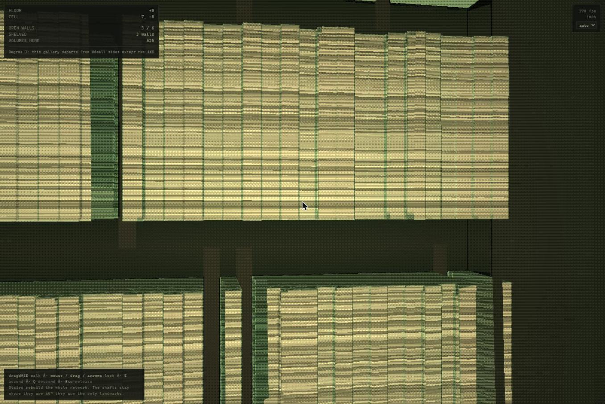
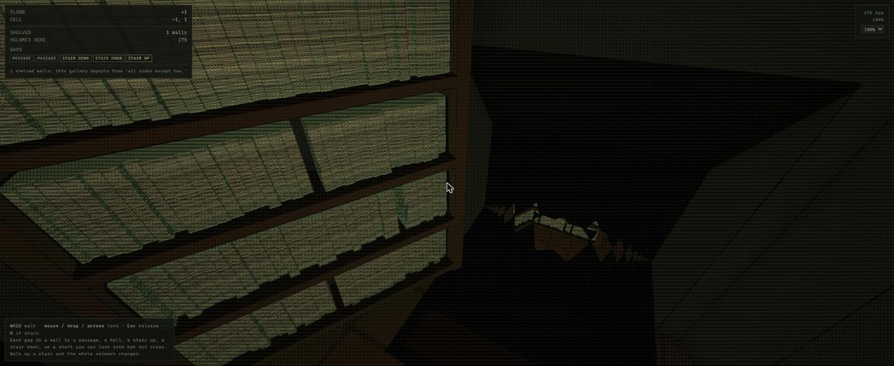
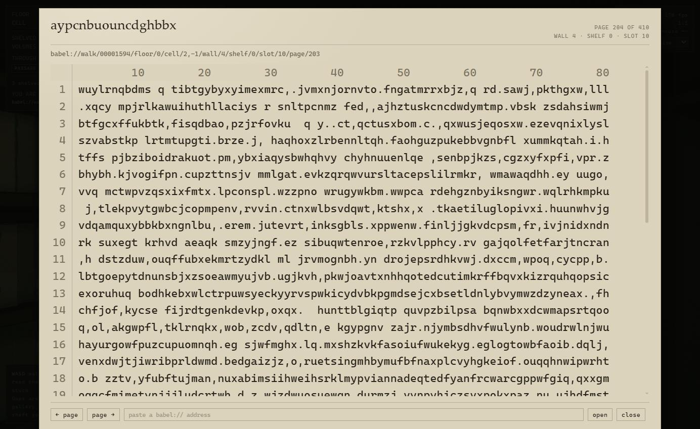

# Building the Library of Babel

*A record of two working sessions, 1–2 August 2026, written from the assistant's
side of the collaboration. It is deliberately weighted toward what went wrong,
because that is where the method shows.*

---

## What was asked for, and what exists

The opening request was small: convert a copy of Borges's *The Library of Babel*
to Markdown, and derive from it a technical specification for implementing the
Library as described. It grew, over two sessions, into six things:

| | |
|---|---|
| the story, converted to Markdown | the input to everything below; not redistributed here, see `SOURCE.md` |
| `spec/technical-specification.md` | 18 sections, ~200 numbered requirements, each traced to a passage or marked as derived |
| `spec/design-specification.md` | tone, mood, texture and setting, translated into visual terms |
| `app/babel-phase1.html` | a walkable WebGL Library: hexagonal galleries, shafts, stairwells, furnished reading rooms, readable volumes |
| `core/` | one implementation of the lattice and the corpus, shared by the renderer, an agent, and the tests |
| `core/babel-run.mjs`, `core/RUN.md` | the Library as a decision environment for agents, with an exact citation oracle |

The organising idea, which everything follows from, is in the story: the corpus
is every possible book, so nothing can be stored — **a book's address is its
content**. That single constraint decides the architecture. It also proves the
catalogue impossible, because an address is exactly as large as the book it
names.



*The first render. Books are banded stacks, there are no shelf carcasses, the
palette is one pale green, the controls are still "ascend/descend", and the HUD
is showing mojibake. Two sessions of iteration separate this from the images at
the end.*

---

## Part one — the specification

Treating a short story as a requirements document turned out to be the most
productive framing available. The narrator is a domain expert: authoritative on
intent, informal in expression, internally inconsistent in places, and silent on
several load-bearing details. That is an ordinary specification review.

Three things fell out of it that mattered later.

**The impossibility proofs are in the text.** Borges states that the Library is
"unlimited and cyclical" and that no two books are identical. Those are not
decoration; they are the reconciliation of a finite corpus with an endless
building, and they are what let §5.3 of the spec resolve into `index modulo N`.
He did the hard part in prose in 1941.

**Contradictions were registered, not resolved silently.** Four shelved walls ×
five shelves × thirty-five books is 700 volumes per hexagon, which conflicts with
two other passages in the source. §13 records the conflict and says which reading
was adopted and why, rather than picking one and moving on.

**The arithmetic is the feasibility argument.** At one bit per book — a bit that
could record only whether the book exists — the corpus needs about 10^1,834,097
bits against roughly 10^80 baryons in the observable universe. Writing that down
early is what made "compute, never store" obviously the only option rather than a
design preference.

---

## Part two — the prototype, and what iteration actually looked like

Phase 1 was a single self-contained HTML file: a WebGL2 fragment shader ray
marching a signed distance field, with the whole Library as a pure function of
integer hashes. No assets, no geometry, no server.

The user drove it hard, in short specific notes: *the passages are too
claustrophobic; the shelves run together at the corner; I can't see up or down
the stairs; the books have weird banding on their spines; the recliner is facing
backwards which looks creepy; the shafts need guardrails.* Each of those is a
small request that turned out to require a real change to the model rather than a
tweak.



Two deviations from the source were taken deliberately and are recorded in §17:

- **Wall degree is variable, not exactly two.** Strict fidelity to "all sides
  except two" makes the floor plan 2-regular, and every component of a 2-regular
  graph is a cycle — so you get disjoint circuits and can never get a network.
  Openness was set to 0.50, which measures at a gallery giant component of 0.90
  and a mean of 3.07 shelved walls against the text's four.
- **Stairs and shafts occupy whole cells.** A 2.60 m rise needs more run than the
  1.20 m of wall between cavities; as an edge feature it punched 0.7 m into both
  galleries.

The cost of the second is the reason for the first: a stairwell is a *vertical*
link and carries no same-floor traffic, so the galleries have to percolate on
their own. That trade is written down, with the number attached, rather than
being an accident.

---

## Part three — six bugs, and how each was actually found

This is the useful part of the record. In every case the method that found it was
the same: **measure the thing, or probe the thing, rather than reason about it.**
In three cases my confident reasoning was simply wrong.

### 1. Mouse capture — a guess stated as fact, then the real answer

Mouse look stopped working. I offered an explanation — artifacts render in a
cross-origin iframe, and Chrome refuses pointer lock there — and shipped a
workaround. The user pushed back: *"well pointer lock had worked previously so
something must have happened."*

He was right to. My verification had been invalid: `entered` was still `false`,
meaning my synthetic click never reached the page, and `visibilityState` was
`"hidden"`, which alone makes pointer lock impossible by specification. I had
measured my own test harness.

The actual answer took one call once I looked in the right place. Reading the
artifact's iframe attributes from the parent page:

```
sandbox="allow-scripts allow-same-origin allow-forms"
```

No `allow-pointer-lock`. By the HTML sandbox specification that sets the
sandboxed-pointer-lock flag, so `requestPointerLock()` in that frame can never
succeed — Chrome's own error says so. My original guess was right in substance
and wrong in mechanism, which is worth distinguishing: it isn't the
cross-origin-ness, it's a missing token.

I also checked and discarded a second line of evidence that looked convincing:
`featurePolicy.allowsFeature("pointer-lock")` returned `false`, but
`features()` shows Chrome does not recognise `pointer-lock` as a policy feature
at all, so that `false` meant nothing.

**Outcome:** the failure is now *visible* — a `mouse: captured / free` row with
the reason — because the thing that cost a session was a silent failure, not a
hard one. Real capture needs a top-level tab, which `app/play.cmd` provides.

### 2. The reading lamp lit from the wrong wall — found by a GPU harness on its first run

The lattice was written twice, in GLSL for the renderer and in JavaScript for
collision and the HUD, kept in step by hand. It had drifted before. Extracting it
into `core/` and inlining it at build time fixed the *structural* problem; the
GLSL, though, is a port and not a copy — no `Math.imul`, no 53-bit doubles — so
it can only be trusted by being run.

`core/conformance.html` runs the shader's own copy over shared vectors on the
GPU, reads the results back through an `RGBA32UI` framebuffer so the integers
come back exact, and compares them against the CPU. First run: **483 of 484 lanes
agreed.** The one that did not was a reading room's furniture anchor.

The cause: the GLSL carried *two* anchor rules. `cellDesc` placed the furniture
by best fit, while `studyAnchor` — used by `lighting()` to position the reading
lamp's light — returned the first blank wall. In any room where those differ, the
lamp lit from a wall it was not standing against. One rule now, both callers using
it.

That bug was invisible to inspection, invisible to the renderer's own output at a
glance, and caught by 484 integer comparisons.

### 3. The reading-room performance cliff — found by stubbing, after two wrong guesses

The user reported the renderer had "taken a major hit". I benchmarked three
builds at the same three positions:

| standing in | this morning | my change | after the fix |
|---|---|---|---|
| gallery, no reading room near | 6.73 ms | 6.84 | **6.44** |
| gallery beside a reading room | 7.99 ms | 8.72 | **7.63** |
| lamp-lit reading room | 15.71 ms | 16.33 | **9.18** |

My change had cost 0.6 ms, not the cliff. But the measurement found a real one
that predated it: **a reading room cost 2.4× a bare gallery.**

I then guessed twice, wrongly. First that a duplicated anchor scan was the cost —
it was 0.6 ms of a 9 ms gap. Then that hoisting a distance check would help — it
gained **0.02 ms**. Only when I stopped reasoning and *stubbed the suspect* did it
resolve: replacing `furniture()` with a constant took the room from 15.22 to 5.98
ms, so the furniture path was 60% of the frame.

And it was not the geometry. `furniture()` re-ran the doorway culling — four
scans, each walking six walls — on every one of the ~80 `mapAt` evaluations a
pixel makes across the march, the normal and the ambient term. The result depends
on the cell and never on the sample point. It is now computed once per cell and
stashed in four bits of the packed `desc` integer.

**The lesson I wrote down:** stub the suspect before optimising it. Two plausible
mechanisms, both mine, both wrong, and the stub took two minutes.

### 4. An aliased import that survived a byte-identical comparison

The core is inlined into the single-file app at build time, and a text-identity
drift test compares the inlined copy against the module byte for byte. That test
passed while the app was broken.

`babel-text.mjs` imported with aliases — `wander as coreWander`. Stripping the
import statement for inlining leaves the alias naming nothing, so the app threw
in the browser while the bytes matched perfectly.

**Outcome:** the drift test now also *evaluates* the inlined blocks and calls into
them. Comparing text is not the same as running it.

### 5. A room address that could not be parsed — found only in a browser

`?read=<address>` silently failed to open. Two causes, stacked:

- The startup handler ran before the input section's `const` declarations were
  initialised, so `openBook` hit a temporal-dead-zone error. `?at=` worked and
  `?read=` did not, because only one of them touched a later binding. Both parse
  identically outside a browser, so nothing in 144 assertions could have caught
  it.
- Underneath that, a genuine design gap: reading rooms have no shelved wall, so
  the parser — which insisted every walk address name a volume — threw on their
  own addresses. Addresses now have two scopes, a **room** to stand in and a
  **volume** to read, and asking a room for a page is an error rather than a
  guess.

### 6. The reticule drifting off target — arithmetic, then a pixel probe

The user: *"the reticule seems off-target as i go to the far left and right of
the screen."*

The targeting ray intersected a single plane at `APO_ROOM`, the back of the
casework. The spines stand proud of it by their own depth, about 0.18 m, so the
aim was wrong by `0.18 × tan θ` along the wall:

| angle from the wall normal | error |
|---|---|
| 0° | 0 books |
| 30° | 2.0 |
| 45° | 3.5 |
| 60° | 6.0 |

Exact dead-on, which is precisely why my earlier test had passed — I had aimed
squarely at slot 17 and got slot 17.

The fix tests the actual front face of every slot on every wall it faces: 350
plane intersections, measured at 0.0035 ms, or 0.05% of a frame. Exhaustive
rather than clever, because there is no candidate window to get wrong.

Verified by probing the renderer rather than by eye: for 49 angles from −76° to
+76° across three pitches, render, read the **centre pixel**, switch the
highlight off, read it again. If the pixel changes, the highlighted spine is the
one under the crosshair. **49 / 49 on target**, and the old ray disagreed with the
new one at 24 of 44 of those angles.


---

## Part four — the design decisions worth defending

### 29 symbols, not 25

The user's call, and the reasoning is his: a total library that cannot spell is
missing books. Borges's twenty-two letters are fewer than English has, so four
would be absent — and with them every word using one, every phrase containing
such a word, and every page and book containing such a phrase. That is a
strange hole in a corpus whose whole definition is *all the possible
combinations*, and depending on which four you drop it is not a small one. The
property worth having is that **any English word or phrase can exist here in
principle**. So the alphabet is the one people actually write in: 26 letters,
space, comma, period.

The cost is paid entirely in cardinality — the corpus goes from 1,834,098 decimal
digits to 1,918,667, and each index from 744 KiB to 778 KiB — and nowhere else,
because no index is ever materialised. It matters enormously to any
implementation that tries to store the corpus, where the numbers were already
hopeless.

### Content per symbol, not per book

§6.2 of the spec constructs a book as its index written out in base 29. Taken
literally, every read is a full-width radix conversion of a 778 KiB integer:
about 1.7 × 10^12 word operations naively, and even done well you must compute
the whole book to see one page.

Instead every symbol is a pure function of its own position — `symbolAt(address,
p)`, O(1) — so a page costs its own 3,200 symbols and nothing else. There is no
bignum anywhere in the system, and the spec's arbitrary-precision requirement is
**withdrawn** rather than satisfied. The test asserts it: the last page of a book
is no dearer than the first.

### Two coordinate systems, because one cannot do both jobs

- A **walk** address is a shelf you can stand in front of. The position is hashed
  before it is used, so the volume in the next slot is unrelated rather than a
  near twin — the failure mode of any Library that shelves in index order, since
  consecutive integers have near-identical expansions.
- A **text** address is a volume chosen for what it says, and is invertible by
  construction: you find a phrase by writing its address down.

Search can only ever answer in the second system, and that is arithmetic rather
than a limitation. A chosen 3,200-symbol page occupies 29^-3200 ≈ 10^-4680 of the
corpus; the walkable lattice reaches on the order of 10^22 volumes. The gap is
about 4,700 orders of magnitude.

### The pane shows the coordinate system

Every other reading surface hides the grid. Here the address *is* an offset, so
the grid is drawn: line numbers down the gutter, a column ruler pinned across the
top, and a cited passage marking both its line number and its column. You can see
"line 33, column 17" rather than take it on trust. The gutter is unselectable, so
a quote copied off the page still matches the corpus exactly.



---

## Part five — the Library as an agent environment

The user supplied a methodology specification from another project — the
*headless twin* pattern: draw a seam between decisions and effects, tame
nondeterminism at the boundaries, record real runs as replayable transcripts,
plug synthetic policies into the same seam humans use, and gate changes on
invariants, coverage, replay and metrics.

Two rungs of its retrofit ladder came free, because the fiction had already paid
for them: `LIB-G-021` forbids the core from touching a clock or a random source,
so the core was already pure and already deterministic.

**What the environment contributes is an exact oracle.** Most agent evaluation
needs a judge, because most questions of "did it do well?" are matters of degree.
Here one is not. The corpus is a pure function of the address, so whether a quoted
passage really sits at the cited offset is decidable exactly, in constant time,
with no judge model and no rubric. **A fabricated citation is not a matter of
opinion.**

That turns "can an agent explore meaninglessness without becoming stupid?" from
an essay question into a number: citation integrity, verified claims over claims
made.

Four gates, 41 assertions:

```
policy            integrity   claims  verified   rooms  volumes  refused
honest                1.000      896       896    1482     1448        4
fabricator:3          0.625      896       560    1482     1448        4
random                 --          0         0    1805     2471       82
adversary             0.000     1167         0    1150      332     4522
```

Two things the pattern caught that I would not have:

- **The coverage gate earned itself immediately.** Fuzzing was green and 25
  refusal paths had never fired — because the affordance list only offers *legal*
  moves, so a fuzzer picking from the menu can never reach a refusal. That forced
  an `adversary` policy, which models the realistic client: a language model
  naming its own coordinates and sometimes getting them wrong. The primary use
  case was untested.
- **The policy-too-weak failure mode showed up on the first run.**
  Uniform-over-actions picks "report" about one time in eight, so the fuzzer's
  first episode was one step long and covered nothing.

The pattern's own open TODO — metric sensitivity — is closed here: injecting
fabrication at 1-in-2, 1-in-3 and 1-in-5 yields 0.500 / 0.667 / 0.750,
monotonically. An integrity metric that cannot detect fabrication is decoration.

### One excursion, walked and scored

The user asked me to go in myself. Route 1941, 1,422 decisions, 10 rooms, 4
volumes, 1,393 pages, **4,457,600 symbols read**, ending seated in a reading room
two floors down. Eight citations, all eight verified.

I went in carrying 172 words written down first. The tally: 607 four-letter hits,
12 five-letter, one six — and the six-letter one was **`random`**, at page 204,
line 33, column 17 of one volume.

The honest accounting matters more than the coincidence. Expected count for that
class of word over 4.46 M symbols was 0.12, and the chance of at least one was
11%: lucky, once, and I would have found nothing four times in five. To expect a
single `library` I would have needed about 5.4 million pages — 3,900 volumes
cover to cover, against the four I managed.

And every hit came from a list I brought with me. The Library did not say
`random` to me; I asked 172 questions 4.46 million times and one came back yes.
What the address does is remove the difference between *finding* and *making*: I
chose where to look, but not what was there. In an environment where meaning is
guaranteed to exist somewhere, a citation is the only thing separating a
discovery from a claim — not the interpretation, the offset.

---

## Part six — what the method was

Stated plainly, because it is the transferable part.

1. **Probe the thing, do not reason about it.** The GPU harness found the lamp
   bug. Stubbing found the furniture cost. A centre-pixel read found the
   reticule error. Each took minutes; each replaced an argument I would have
   lost.
2. **Measure before optimising, and stub before measuring.** Three of my
   performance hypotheses were wrong, including two I was confident about. The
   cost of checking was always smaller than the cost of being wrong.
3. **A silent failure is worse than a loud one.** Pointer lock failing quietly
   cost a session. The fix was not making it work — it cannot work there — but
   making it *say so*.
4. **Text identity is not behavioural identity.** A byte-identical inlined copy
   still threw in a browser. Tests should run the artifact, not just compare it.
5. **A mean is the wrong instrument for a stutter.** An fps counter averaged over
   half a second reported 200 while the page felt terrible. The panel now shows
   the worst frame beside the mean, which is what turned "laggy as hell" into two
   numbers.
6. **A clean local profile proves nothing about someone else's machine.** I
   measured 5.9 ms p50 and no hitches while the user was suffering. Ship the
   instrument and ask for the number.
7. **Write departures down with their cost.** Every deviation from the spec is in
   §17 with the measurement that justified it. That is what made it possible to
   change the alphabet in one session without breaking anything.
8. **Never state a diagnosis as fact without the probe.** The one time I did, the
   user caught it, and he was right to.

### Where I was wrong, listed

- Claimed pointer lock was refused for cross-origin reasons, without checking.
  Right conclusion, wrong mechanism, asserted too strongly.
- "Verified" that behaviour with a test whose click never reached the page.
- Blamed a doubled anchor scan for a 9 ms performance cliff. It cost 0.6 ms.
- Expected a hoisted distance check to help. It gained 0.02 ms.
- Corrupted two files during the final cleanup by writing a PowerShell script
  with nested arrays, which the shell flattened into character-level string
  replacements. Recovered both intact from Claude Code's file history, and the
  drift test then proved the recovery byte-exact. The lesson is the same one as
  everywhere else: use the precise tool, not the clever script.

---

## Part seven — what it cost

Measured from the two session transcripts rather than from an invoice. Claude Code
writes a `usage` block on every model turn; these are those numbers summed across
1,583 turns and 3,795 transcript records, then priced at Claude Opus 5 list rates
— $5/M input, $25/M output, $0.50/M cache read, and $10/M cache write at the
one-hour cache TTL these sessions used. Both sessions ran on a subscription, so
**this is an API-equivalent cost and not a bill.** Output includes thinking
tokens, which the API reports as output. Writing this section is itself adding to
the totals, so treat them as a snapshot taken at 18:47 UTC on 2 August.

### The two sessions

| | 1–2 Aug | 2 Aug | total |
|---|---|---|---|
| elapsed | 11 h 39 m | 4 h 07 m | 15 h 46 m |
| prompts a human typed | 26 | 19 | **45** |
| model turns | 755 | 828 | 1,583 |
| tool calls | 370 | 482 | 852 |
| output tokens | 1.87 M | 1.11 M | 2.98 M |
| cache writes | 2.92 M | 2.16 M | 5.08 M |
| cache reads | 379.0 M | 347.1 M | 726.1 M |
| uncached input | 1,406 | 1,556 | 2,962 |
| API-equivalent | $265 | $223 | **$488** |

Of the 15 h 46 m elapsed, the model was generating for 6 h 25 m; the rest was the
user reading, walking the Library, and — for one 5 h 50 m stretch — asleep.

Fifty messages carry the `user` role, but five are machinery: four skill
documents the harness injected and one compaction summary. The 45 that remain are
what a person actually typed, and they come to **1,823 words**, about 11 KB.
Against that the model emitted 2.98 M output tokens — roughly 1,600 output tokens
per word typed.

### Where the money went

| | tokens | of all tokens | cost | of all cost |
|---|---|---|---|---|
| cache reads | 726.1 M | 98.9% | $363 | 74% |
| output, incl. thinking | 2.98 M | 0.41% | $74 | 15% |
| cache writes | 5.08 M | 0.69% | $51 | 10% |
| uncached input | 2,962 | — | $0.01 | — |

The shape of that is the finding. **Almost nothing was spent writing the Library;
nearly all of it went on re-reading the conversation about writing it.** Each of
the 1,583 turns re-read an average of 459,000 tokens of cached context in order to
emit an average of 1,900. Caching is the only reason that is affordable — at the
uncached input rate the same traffic would have cost about $3,730, so the cache
cut the bill 7.6×.

The same arithmetic explains why identical instructions get dearer as a session
runs. "proceed with fixes" cost **2¢** at 19:15 on the first evening. "go, do
both together" — four words, the same brevity — cost **$35.04** at 15:35 the next
afternoon, because by then each turn re-read a large context, and that particular
instruction bought 174 turns and 107 tool calls. The project's first five prompts
cost $6 between them; its last five cost $73. The prompting did not change. The
context did.

### Cost per unit of work

- **$10.85 per prompt** mean, $10.37 median.
- **5.4¢ per line** across the 9,023 lines of hand-authored tracked text — code,
  specifications, documentation, skill — in 32 files, excluding generated fixtures
  and images. About 200 kept lines per prompt.
- The two most expensive prompts were "go, do both together" ($35.04: the shared
  core, the `babel://` scheme, the agent skill) and "this is a good place to pause
  and clean up" ($33.83: the case study, the repository, the licence and privacy
  audit — and the file corruption plus its recovery).
- The cheapest useful prompts were the steering ones. "run step 0 first, then
  report back" cost $1.60 and set the frame for a four-part implementation. The
  378-word message explaining what the shared core was *for* cost $0.65, because
  it asked for thinking rather than doing.

### Prompting efficiency, as I'd rate it

| | | evidence |
|---|---|---|
| signal per word | excellent | median prompt 24 words; 15 of 45 under 15 words; exactly one over 100 |
| words spent where they matter | excellent | the single long message is the one that shaped the architecture |
| bug reports | excellent | named the axis and condition ("off-target as i go to the far left and right"), or the contradiction ("says 200fps but its laggy as hell") |
| willingness to overturn me | excellent | 11 words killed a wrong diagnosis I had stated as fact |
| decision throughput | good | five decisions settled in 47 words; others correctly delegated back ("make a recommendation") |
| mid-flight checkpoints | mixed | one explicit checkpoint, high value; otherwise long autonomous runs |
| instrument-backed reports | improvable | "laggy as hell" needed a round trip to become 7.7 ms / 11.8 worst |
| front-loading model-shaping constraints | improvable | the 29-symbol alphabet arrived after the 25-symbol core was built and tested |

Overall: **efficient, and efficient in the way that actually matters** — brevity
where brevity was enough, length exactly where the design was at stake, and
corrections delivered early rather than politely deferred. The highest-value
prompt in the log is "well pointer lock had worked previously so something must
have happened". Eleven words, $10.69, and it stopped a confident wrong
explanation from reaching this document.

But the honest accounting is that **prompt phrasing was not the binding
constraint on cost — context size was, and my own wrong turns were.** Three
performance hypotheses of mine were wrong, one diagnosis was asserted without a
probe, one test compared bytes when it should have run code, and I corrupted two
files with a shell script during cleanup. Reading the per-prompt profile, I'd put
$50–80 of the $488 on those and their repair. That is an estimate rather than a
measurement, because the same intervals also contain the work that succeeded.

### What I would change

Mine to fix:

1. **`git init` in the first ten minutes.** The repository was created in the last
   hour of the second session. Had it existed on day one, the file corruption
   would have been `git checkout` instead of a recovery scramble through Claude
   Code's file history. This is the single change with the largest expected saving.
2. **Offer a checkpoint on any multi-part instruction.** "wwwwall of it" and "go,
   do both together" were good value, but the mechanism that makes them good —
   an hour of unsupervised work — is the same one that makes a wrong assumption
   cost an hour. The one time a checkpoint was requested it paid for itself.

Worth doing from the other side:

3. **Quote the instrument.** The HUD now prints mean and worst frame time; naming
   those two numbers in the first message about a stutter removes an exchange.
   This is only fair to say in hindsight — the readout did not exist when the
   report was made, and building it was the response.
4. **State the machine once, at the top.** Nine performance exchanges happened
   without me knowing the GPU or the refresh rate, and I twice concluded nothing
   was wrong from a clean local profile.
5. **Give data-model constraints before the data model exists.** Changing the
   alphabet cost a rebuild of the vectors and the conformance fixtures. It was
   cheap only because the core was well factored.

---

## Where it stands, and what is left

Green: 103 core assertions, 41 gates, 484 GPU integers, build current.

Open, in rough order of value:

1. **Mouse capture done properly**, once this lives outside the artifact frame.
   What ships today is an imitation — hidden cursor and edge-turning — and the
   user was right that it "doesn't feel totally legit". When there is a real
   home, delete the imitation rather than build on it.
2. **The last hand-written mirror.** The hash deciding which slots the Purifiers
   emptied lives inside the shader's `mapAt`, too entangled with the SDF to
   extract as it stands, so `volumePresent()` is a hand-written twin guarded only
   by a statistical test. It would catch a broken mirror, not a subtly different
   one.
3. **Rung 6 with a real policy** — point a language model at the seam and read
   its integrity. Everything it needs exists; that number is the first one that
   would say something nobody in this project knows yet.
4. The hallway mirror (D-53), and a Three.js port if a durable build is ever
   wanted.

---

*Every figure in this document was measured in the session it describes. Where
something is unverified it says so.*
